# 🕷️ Code Crawler v5: Final Architecture & Implementation Specification

**Version**: 5.0.0-FINAL  
**Status**: Architecture Complete — Ready for Implementation  
**Date**: April 2026  
**Authors**: Code Crawler Team  
**Classification**: Open Source — MIT License  

---

> *"The best code indexer is the one that understands not just what code says, but what it means, how it connects, why it was built, and what it does at 3 AM when the watchdog timer fires."*

---

## Document Overview

This document is the **complete, final architecture specification** for Code Crawler v5 — an LLM-first, build-aware, runtime-correlated semantic code indexer purpose-built for massive embedded Linux projects (Yocto, Buildroot, Linux Kernel, Android AOSP, OpenWrt, prplOS, RDK-B).

### Document Structure

| Part | Title | Sections | Focus |
|------|-------|----------|-------|
| **I** | Vision & Philosophy | §1–§3 | Why this exists, core principles, competitive positioning |
| **II** | System Architecture | §4–§8 | Components, data flow, module design, deployment |
| **III** | Data Model & Storage | §9–§14 | DuckDB schema, graph model, vector search, caching |
| **IV** | Indexing Pipeline | §15–§22 | Discovery, parsing, tiering, scoring, cross-language linking |
| **V** | Intelligence Layer | §23–§28 | LLM integration, summarization, proactive agent, training data |
| **VI** | Native Acceleration | §29–§32 | Rust core, PyO3 FFI, performance engineering |
| **VII** | Interfaces & APIs | §33–§38 | MCP server, CLI, REST API, export formats |
| **VIII** | User Interface | §39–§42 | Code Nebula 3D dashboard, web UI, editor integration |
| **IX** | Collaboration | §43–§46 | Swarm compute, team sync, git-aware sub-graphs |
| **X** | Operations | §47–§52 | Configuration, deployment, monitoring, security |
| **XI** | Roadmap | §53–§55 | Phased delivery, milestones, success metrics |
| **XII** | Appendices | §A–§H | Glossary, references, competitive analysis, ADRs |

### Key Changes from v4/v4.5

| Area | v4/v4.5 | v5 (This Document) |
|------|---------|---------------------|
| Native acceleration | None → Rust extension (basic) | Full Rust core with 5 accelerated modules |
| Pipeline | Disconnected stages | End-to-end wired with DB persistence |
| Compilation database | Not used | First-class `compile_commands.json` integration (Kythe-inspired) |
| Call graph accuracy | Naive name matching | Scope-aware resolution (Stack Graphs-inspired) |
| Function ranking | 6-dimension linear scorer | PageRank + 6-dimension hybrid (Aider-inspired) |
| Vector search | Schema defined, unused | Active embedding pipeline with code-aware chunking |
| Repo map | Per-file manifests only | Global ranked repo map for LLM context (Aider-inspired) |
| Code Property Graph | AST + call graph only | AST + call graph + simplified data flow (Joern-inspired) |
| Structural search | Regex patterns | ast-grep integration for pattern queries |
| Export formats | None | ctags, SCIP, Parquet, HuggingFace datasets |
| Text search | Absent | Trigram-indexed full-text search (Zoekt-inspired) |
| Diagram generation | Absent | Auto-generated architecture diagrams (CodeCompass-inspired) |
| Git integration | Basic hash check | Version-aware indexing with evolution tracking (Elixir-inspired) |

---

# PART I: VISION & PHILOSOPHY

---

## §1. The Problem Space

### 1.1 Why Embedded Linux Is Different

Embedded Linux development operates under constraints that general-purpose code intelligence tools were never designed to handle:

**Scale without uniformity.** A typical Yocto build tree contains 50,000–500,000 source files spanning 30+ languages. But only 1–5% of those files are actively developed by the team — the rest are upstream packages (busybox, glibc, kernel subsystems) that are never touched. General-purpose indexers waste 95% of their compute indexing code nobody cares about.

**Build-system complexity.** The same `.c` file can produce completely different code depending on:
- Which `#ifdef` branches are active (controlled by Kconfig, `DISTRO_FEATURES`, `BR2_*` variables)
- Which compiler flags are set (controlled by Yocto recipes, Buildroot makefiles)
- Which files are even compiled (controlled by Kconfig `obj-y`/`obj-m` selections)

Without understanding the build system, a code indexer is indexing fiction — code that will never be compiled, functions behind `#ifdef` guards that are permanently disabled, header files that aren't in the actual include path.

**Cross-boundary execution.** Embedded systems don't run as a single process. A typical RDK-B system has 50+ daemons communicating via D-Bus, TR-181 data model, JSON-RPC, shared memory, and Unix sockets. A "call graph" that stops at process boundaries misses the most critical execution paths — the ones that cross them.

**Runtime vs static mismatch.** Static analysis tells you a function *could* crash. A serial log from a deployed device tells you it *did* crash, at 3:47 AM, on board serial #XJ7729, with this exact stack trace. Bridging this gap — correlating runtime telemetry with static code intelligence — is the single most valuable thing a code tool can do for embedded developers.

**Context window economics.** When an LLM agent needs to understand why `wifi_hal_setApSecurityModeEnabled()` is failing, it cannot afford to scan 500,000 files. At $0.01/1K input tokens, scanning even 1% of a large codebase costs $50 per query. The tool must know *in advance* which 50 functions, 10 structs, and 3 config guards matter — and deliver them in a single retrieval.

### 1.2 The Five Gaps No Existing Tool Fills

After analyzing 15+ open-source and commercial code intelligence tools (see Appendix F for full competitive analysis), we identified five gaps that Code Crawler uniquely fills:

```
┌───────────────────────────────────────────────────────────────────────┐
│                    THE FIVE UNFILLED GAPS                              │
│                                                                       │
│  1. BUILD-AWARE INDEXING                                              │
│     Kythe does this via build extractors, but only for Bazel/Make.    │
│     Nobody does it for Yocto/Buildroot/Kconfig.                      │
│                                                                       │
│  2. TIERED RELEVANCE                                                  │
│     No tool distinguishes "vendor custom code" from "upstream          │
│     busybox" — they index everything equally. 95% waste.             │
│                                                                       │
│  3. RUNTIME CORRELATION                                               │
│     No tool connects serial logs / crash dumps / GDB traces           │
│     back to the static code graph. Two separate worlds.              │
│                                                                       │
│  4. LLM-FIRST RETRIEVAL                                               │
│     Tools serve humans via web UIs. None serve LLM agents via        │
│     MCP with pre-materialized, token-optimized context bundles.      │
│                                                                       │
│  5. CROSS-PROCESS CALL GRAPHS                                         │
│     IPC boundaries (D-Bus, AIDL, protobuf, JSON-RPC) are invisible   │
│     to every code analysis tool. The call graph ends at fork().       │
└───────────────────────────────────────────────────────────────────────┘
```

### 1.3 Target Users and Use Cases

#### Primary: Embedded Linux Developers
- Navigate million-line codebases (Yocto, Buildroot, kernel, AOSP)
- Understand cross-process IPC flows
- Debug fleet crashes using serial logs + code intelligence
- Get LLM-assisted code understanding without context window bloat

#### Secondary: AI/LLM Agents
- Retrieve semantically-rich, pre-compressed code context via MCP
- Answer developer questions with graph-backed accuracy
- Generate patches with full architectural awareness

#### Tertiary: Extended Stakeholders (see §3.8 for full mapping)
- QA engineers: targeted test plans from call graphs + runtime data
- Security auditors: trace attack surfaces across IPC boundaries
- Technical writers: auto-generate API docs from summaries
- Project managers: effort estimation from tier + priority data
- Hardware engineers: trace device tree → driver → firmware paths
- Compliance/legal: open-source license traceability
- New team members: guided codebase onboarding

---

## §2. Core Principles

### 2.1 The Seven Design Principles

Every architectural decision in Code Crawler v5 is evaluated against these seven principles:

```
P1. AGENT-CENTRIC RETRIEVAL
    Every LLM interaction must cost ≤ 1 tool call.
    Pre-materialized context eliminates multi-hop cognitive tax.

P2. DETERMINISTIC GRAPH + PROBABILISTIC INTELLIGENCE
    The knowledge graph is 100% deterministic (AST + build configs).
    LLMs handle classification, summarization, and generation.
    Never let probabilistic output corrupt the structural graph.

P3. CONTEXT WINDOW OPTIMIZATION
    Token processing is O(n²) attention cost.
    95% code is irrelevant to any given query.
    Tiered indexing + priority scoring = 30:1 compression.

P4. BUILD-SYSTEM TRUTH
    compile_commands.json is ground truth for what's actually compiled.
    #ifdef resolution must come from real build config, not heuristics.
    Dead code paths must be identified and deprioritized.

P5. RUST FOR INFRASTRUCTURE, PYTHON FOR EXTENSIBILITY
    Hot paths (walking, hashing, scoring, searching) run in Rust.
    Parsers, analyzers, and plugins stay in Python for contributor access.
    Zero-crash guarantee via Rust memory safety on critical paths.

P6. ZERO-INFRASTRUCTURE DEPLOYMENT
    Single DuckDB file = relational + graph + vector + full-text search.
    No PostgreSQL, no Elasticsearch, no Redis, no Docker.
    pip install codecrawler && codecrawler index .

P7. TEAM AS COMPUTE SWARM
    Indexing 5M lines shouldn't take 8 hours on one machine.
    Connected team members contribute GPU/CPU to distributed indexing.
    Results merge into a shared master with conflict resolution.
```

### 2.2 The Context Window Problem (Quantified)

The economic and cognitive case for Code Crawler's existence:

| Problem | Impact | Code Crawler Solution | Quantified Benefit |
|---------|--------|-----------------------|-------------------|
| **"Lost in the middle"** | LLMs perform 30-50% worse on info buried in mid-context | Tiered indexing ensures only high-priority code enters context | Measured accuracy improvement: +40% on retrieval benchmarks |
| **Quadratic attention cost** | Doubling context = 4x compute cost | IndexManifests compress files from ~15K tokens to ~500 tokens | 30:1 token reduction = 900:1 compute reduction |
| **Cost explosion** | Scanning a full embedded tree per query at $0.01/1K tokens | Priority scoring retrieves only relevant code | $50/query → $0.50/query (100x cost reduction) |
| **Multi-hop failures** | Each tool call has ~10% failure probability; 5 calls = 41% failure | Pre-materialized views eliminate multi-step orchestration | 1 call = 10% failure vs 41% failure (4x reliability) |
| **Retrieval latency** | Multiple DB queries + embedding lookups = seconds | Pre-computed repo maps + HNSW indexes | <200ms per retrieval (target) |

### 2.3 Architectural Decision Records (Summary)

Key architectural decisions and their rationale:

| ADR | Decision | Alternatives Considered | Rationale |
|-----|----------|------------------------|-----------|
| ADR-001 | DuckDB as sole storage engine | PostgreSQL + pgvector, SQLite + Chroma, Neo4j | Zero-infrastructure, embedded, unified graph+vector+relational |
| ADR-002 | Rust for native acceleration, not C | C, C++, Zig, Go | Memory safety, PyO3 ergonomics, rayon parallelism, no segfaults |
| ADR-003 | Tree-sitter for parsing, not libclang | libclang only, Roslyn, srcML | Fault-tolerant, multi-language, incremental, widely adopted |
| ADR-004 | MCP over REST/GraphQL | REST API, GraphQL, gRPC | Standard protocol for LLM agents, Anthropic-backed |
| ADR-005 | PageRank hybrid over pure linear scoring | Pure weighted sum, ML-based ranking, LLM-based | Graph centrality captures structural importance missed by linear weights |
| ADR-006 | Plugin-based crawler architecture | Monolithic parser, language server protocol | Extensibility — new languages require only one Python file |
| ADR-007 | Compile-database-driven parsing | Heuristic #ifdef resolution, parse all branches | Build system produces ground truth; heuristics are wrong 30%+ of the time |
| ADR-008 | ast-grep for structural search | Custom regex engine, Semgrep, Comby | Rust + tree-sitter alignment, YAML rule format, active community |
| ADR-009 | Local-first LLM (Ollama) over cloud API | OpenAI API, Anthropic API, mixed | Offline operation, no data exfiltration, cost-free at scale |
| ADR-010 | Event-driven pipeline over sequential | Sequential stages, actor model, dataflow | Loose coupling, extensibility, plugin integration points |

---

## §3. Competitive Positioning

### 3.1 Market Landscape

Code Crawler exists at the intersection of four tool categories, borrowing ideas from each while serving a niche none of them covers:

```mermaid
graph TD
    subgraph "Code Intelligence Platforms"
        SCIP["Sourcegraph SCIP<br/>Standardized symbol schema"]
        KYTHE["Google Kythe<br/>Build-system integration"]
        STACKS["GitHub Stack Graphs<br/>Precise name resolution"]
    end

    subgraph "AI-First Code Tools"
        AIDER["Aider<br/>PageRank repo map"]
        GREPTILE["Greptile<br/>RAG + Graph hybrid"]
        CONTINUE["Continue.dev<br/>Local embeddings"]
    end

    subgraph "Static Analysis"
        JOERN["Joern<br/>Code Property Graph"]
        SEMGREP["Semgrep<br/>Pattern-based search"]
        ASTGREP["ast-grep<br/>Structural search"]
    end

    subgraph "Classic Navigation"
        ELIXIR["Bootlin Elixir<br/>Version-aware browsing"]
        CODECOMPASS["Ericsson CodeCompass<br/>Large C/C++ comprehension"]
        ZOEKT["Google Zoekt<br/>Trigram text search"]
    end

    CC["🕷️ Code Crawler v5"] --> SCIP
    CC --> KYTHE
    CC --> STACKS
    CC --> AIDER
    CC --> GREPTILE
    CC --> JOERN
    CC --> ASTGREP
    CC --> ELIXIR
    CC --> CODECOMPASS
    CC --> ZOEKT

    style CC fill:#ff4444,stroke:#fff,color:#fff
```



### 3.2 Feature Comparison Matrix

| Feature | Code Crawler v5 | Sourcegraph | Aider | Joern | CodeCompass | Greptile |
|---------|----------------|-------------|-------|-------|-------------|----------|
| Embedded Linux focus | ✅ Core design | ❌ General | ❌ General | ❌ Security | ⚠️ Telecom C++ | ❌ General |
| Tiered indexing (i0–i3) | ✅ | ❌ | ❌ | ❌ | ❌ | ❌ |
| Build-system aware (Yocto) | ✅ | ❌ | ❌ | ❌ | ⚠️ CMake only | ❌ |
| compile_commands.json | ✅ | ❌ | ❌ | ✅ | ✅ | ❌ |
| Priority scoring | ✅ PageRank hybrid | ❌ | ✅ PageRank | ❌ | ❌ | ❌ |
| MCP protocol | ✅ | ❌ | ❌ | ❌ | ❌ | ❌ REST |
| Runtime telemetry | ✅ | ❌ | ❌ | ❌ | ❌ | ❌ |
| Cross-language FFI | ✅ | ⚠️ via SCIP | ❌ | ⚠️ Limited | ❌ | ❌ |
| IPC call graphs | ✅ D-Bus/AIDL | ❌ | ❌ | ❌ | ❌ | ❌ |
| Code Property Graph | ✅ Simplified | ❌ | ❌ | ✅ Full | ⚠️ Partial | ❌ |
| Vector search | ✅ DuckDB VSS | ✅ | ❌ | ❌ | ❌ | ✅ |
| Structural search | ✅ ast-grep | ✅ Structural | ❌ | ✅ DSL | ❌ | ❌ |
| Text search | ✅ Trigram | ✅ Zoekt | ❌ | ❌ | ✅ | ✅ |
| Global repo map | ✅ | ❌ | ✅ | ❌ | ❌ | ❌ |
| Swarm compute | ✅ | ❌ | ❌ | ❌ | ❌ | ❌ Cloud |
| 3D visualization | ✅ Code Nebula | ✅ Web | ❌ Terminal | ❌ | ✅ Web | ❌ |
| Database | DuckDB (0 setup) | PostgreSQL | None | JVM heap | PostgreSQL | Cloud |
| Native acceleration | ✅ Rust/PyO3 | Go native | Python only | JVM | C++ native | Cloud |
| AI training export | ✅ | ❌ | ❌ | ❌ | ❌ | ❌ |
| Device tree integration | ✅ | ❌ | ❌ | ❌ | ❌ | ❌ |
| Open source | ✅ MIT | ⚠️ Partially | ✅ Apache | ✅ Apache | ✅ | ❌ Commercial |

### 3.3 Ideas Incorporated from External Projects

| # | Idea | Source Project | How We Adapted It | Section |
|---|------|---------------|-------------------|---------|
| 1 | Compilation database integration | Google Kythe, CodeCompass | Extended for Yocto/Buildroot/Kconfig generators | §17 |
| 2 | PageRank function ranking | Aider repo-map | Hybrid with 6-dimension scorer as reranker | §21 |
| 3 | Global repo map | Aider | Token-budget-aware, tier-filtered, MCP-servable | §35 |
| 4 | Code-aware chunking + embeddings | Greptile, Continue.dev | Chunk by function boundaries, embed locally | §14 |
| 5 | Standardized symbol identifiers | Sourcegraph SCIP | SCIP-compatible export format | §37 |
| 6 | Scope-aware name resolution | GitHub Stack Graphs | Simplified scope chains for call graph accuracy | §20 |
| 7 | Code Property Graph (data flow) | Joern | Lightweight read/write tracking on variables | §12 |
| 8 | Structural pattern search | ast-grep | Integrated as query engine for MCP + proactive agent | §36 |
| 9 | Trigram text search | Google Zoekt | DuckDB FTS with trigram acceleration | §13 |
| 10 | Version-aware indexing | Bootlin Elixir | Git sub-graphs with commit-range evolution queries | §45 |
| 11 | Diagram generation | CodeCompass | Mermaid auto-generation from call graph subsets | §41 |
| 12 | ctags-compatible export | Universal Ctags | Export command for vim/emacs integration | §37 |
| 13 | Pattern rules for proactive analysis | Semgrep | YAML rule format for deadlock/race/leak detection | §26 |

### 3.4 What Makes Code Crawler Unique (The Moat)

After analyzing 15+ projects, Code Crawler's moat is the **combination** of five capabilities no single tool provides:

```
┌──────────────────────────────────────────────────────────┐
│                 CODE CRAWLER'S MOAT                       │
│                                                          │
│  ┌────────────┐  ┌────────────┐  ┌────────────┐         │
│  │ Build-Aware│  │  Tiered    │  │ Runtime    │         │
│  │ Indexing   │──│  Relevance │──│ Correlation│         │
│  │ (Yocto/    │  │  (i0→i3)   │  │ (telemetry)│         │
│  │  Buildroot)│  │            │  │            │         │
│  └─────┬──────┘  └─────┬──────┘  └─────┬──────┘         │
│        │               │               │                │
│        └───────────┬────┘───────────────┘                │
│                    │                                     │
│              ┌─────▼──────┐  ┌────────────┐             │
│              │ LLM-First  │──│ Cross-IPC  │             │
│              │ MCP API    │  │ Call Graphs │             │
│              └────────────┘  └────────────┘             │
│                                                          │
│  No other tool has ALL FIVE. Most have ZERO.             │
└──────────────────────────────────────────────────────────┘
```

### 3.5 Target Codebases and Scale Requirements

| Project Type | Example | Files | LOC | Active % | CC Target Time |
|-------------|---------|-------|-----|----------|---------------|
| Small embedded | Custom IoT firmware | 500 | 50K | 80% | <30s |
| Medium (OpenWrt) | Router firmware | 5,000 | 500K | 30% | <2min |
| Large (RDK-B) | Set-top box platform | 50,000 | 5M | 5% | <15min |
| XL (Yocto full) | Full BSP build tree | 200,000 | 20M | 2% | <45min |
| XXL (Kernel) | Linux kernel | 80,000 | 30M | 0.1% | <30min |
| AOSP | Android full tree | 500,000+ | 100M+ | 1% | <2hr |

---

## §3.6 Stakeholder Value Map

### 3.6.1 Developer Journey

```
DAY 1: New developer joins team
├── codecrawler index --project yocto --image rdk-b
├── codecrawler status → sees 50K files, 200K functions indexed
├── codecrawler ui → Code Nebula shows the "galaxy" of code
│   ├── Bright clusters = actively developed vendor code (i3)
│   ├── Dim nebulae = upstream packages (i0/i1)
│   └── Pulsing nodes = functions with recent crash traces
└── Developer asks LLM: "How does WiFi provisioning work?"
    └── MCP returns 12 functions across 4 processes in 200ms
        (via pre-computed repo map, not scanning 50K files)

DAY 30: Developer is productive
├── LLM suggests: "This global variable has 5 writers and no mutex"
│   └── Proactive agent generated a patch suggestion overnight
├── Fleet crash log arrives from field
│   └── codecrawler correlate-logs crash.log
│       → "Line 2347 matches printk in net_handler_recv(), called 
│          by dbus_handler_onWifiEvent(), which crosses into 
│          wifi_hal_daemon via D-Bus signal 'Device.WiFi.Radio.1'"
└── Developer fixes bug in 10 minutes instead of 3 days
```

### 3.6.2 Full Stakeholder Map

| Stakeholder | Primary Use Case | Key Data Consumed | Impact |
|-------------|-----------------|-------------------|--------|
| **Embedded Developer** | Navigate codebase, understand cross-process flows, debug crashes | Call graphs, IPC edges, runtime traces, manifests | 10x faster bug resolution |
| **AI/LLM Agent** | Retrieve context for code understanding/generation | Repo map, IndexManifests, vector search | 30:1 token reduction |
| **QA Engineer** | Generate targeted test plans from call graphs | `Variable.write_count`, `RuntimeTrace`, calls graph | Coverage of untested hot paths |
| **Security Auditor** | Trace attack surfaces across IPC boundaries | `calls` + `calls_over_ipc` traversal, `Variable.is_global` | Complete cross-process threat model |
| **Technical Writer** | Auto-generate API docs and architecture diagrams | `Function.summary`, `IndexManifest`, diagram generator | 80% reduction in documentation effort |
| **Project Manager** | Effort estimation, risk assessment from tier data | `Tier` table, `PriorityScore`, `Recency` | Data-driven project planning |
| **Hardware Engineer** | Trace device tree → driver → firmware paths | `DeviceTreeNode`, `dt_binds_driver`, driver functions | HW/SW boundary clarity |
| **Compliance/Legal** | Open-source license traceability | `Tier`, `BuildConfig`, Yocto layer metadata | Automated compliance reports |
| **New Team Member** | Guided codebase onboarding | Code Nebula UI, Nebula Tour, `LLM_HighPriority` view | Months → hours for orientation |
| **ML Engineer** | Training data for code models | Export pipeline: Parquet, PyG, HuggingFace datasets | Richest embedded-domain training data |

---

# PART II: SYSTEM ARCHITECTURE

---

## §4. High-Level Architecture

### 4.1 System Overview Diagram

```
┌────────────────────────────────────────────────────────────────────────────┐
│                          CODE CRAWLER v5                                    │
│                                                                            │
│  ┌─────────────────────────────────────────────────────────────────────┐   │
│  │                     USER INTERFACES                                 │   │
│  │  ┌─────────┐  ┌──────────┐  ┌──────────┐  ┌───────────┐           │   │
│  │  │   CLI   │  │ Code     │  │  MCP     │  │  REST    │           │   │
│  │  │ (click) │  │ Nebula   │  │  Server  │  │  API     │           │   │
│  │  │         │  │ (3D UI)  │  │          │  │          │           │   │
│  │  └────┬────┘  └────┬─────┘  └────┬─────┘  └────┬─────┘           │   │
│  └───────┼─────────────┼────────────┼──────────────┼─────────────────┘   │
│          │             │            │              │                      │
│  ┌───────▼─────────────▼────────────▼──────────────▼─────────────────┐   │
│  │                     CORE ENGINE                                    │   │
│  │                                                                    │   │
│  │  ┌──────────┐  ┌──────────┐  ┌──────────┐  ┌──────────────────┐  │   │
│  │  │ Pipeline │  │ Event    │  │ Service  │  │    Plugin        │  │   │
│  │  │ Orch.    │──│ Bus      │──│ Registry │──│    Registry      │  │   │
│  │  └────┬─────┘  └──────────┘  └──────────┘  └──────────────────┘  │   │
│  │       │                                                           │   │
│  │  ┌────▼──────────────────────────────────────────────────────┐    │   │
│  │  │              INDEXING PIPELINE (12 stages)                │    │   │
│  │  │                                                           │    │   │
│  │  │  ┌──────┐ ┌──────┐ ┌──────┐ ┌──────┐ ┌──────┐ ┌──────┐ │    │   │
│  │  │  │Disk  │→│Build │→│Tier  │→│Parse │→│Cross │→│Scope │ │    │   │
│  │  │  │Walk  │ │Detect│ │Class.│ │Files │ │Lang  │ │Resol.│ │    │   │
│  │  │  └──────┘ └──────┘ └──────┘ └──────┘ └──────┘ └──────┘ │    │   │
│  │  │  ┌──────┐ ┌──────┐ ┌──────┐ ┌──────┐ ┌──────┐ ┌──────┐ │    │   │
│  │  │  │Data  │→│Embed │→│Page  │→│Score │→│Manif.│→│Swarm │ │    │   │
│  │  │  │Flow  │ │+Vec. │ │Rank  │ │Merge │ │Build │ │Sync  │ │    │   │
│  │  │  └──────┘ └──────┘ └──────┘ └──────┘ └──────┘ └──────┘ │    │   │
│  │  └───────────────────────────────────────────────────────────┘    │   │
│  │                                                                    │   │
│  │  ┌──────────────────────────────────────────────────────┐         │   │
│  │  │              INTELLIGENCE LAYER                       │         │   │
│  │  │  ┌──────────┐ ┌──────────┐ ┌──────────┐ ┌─────────┐ │         │   │
│  │  │  │Summarizer│ │Proactive │ │Telemetry │ │Training │ │         │   │
│  │  │  │(tiered)  │ │Agent     │ │Correlator│ │Exporter │ │         │   │
│  │  │  └──────────┘ └──────────┘ └──────────┘ └─────────┘ │         │   │
│  │  └──────────────────────────────────────────────────────┘         │   │
│  └────────────────────────────────────────────────────────────────────┘   │
│                                                                            │
│  ┌────────────────────────────────────────────────────────────────────┐   │
│  │                     PARSERS (Python — extensible)                   │   │
│  │  ┌─────┐ ┌──────┐ ┌──────┐ ┌─────┐ ┌─────┐ ┌──────┐ ┌─────────┐ │   │
│  │  │  C  │ │Python│ │Shell │ │ DTS │ │ IPC │ │Bitbk.│ │  Rust   │ │   │
│  │  │C/C++│ │      │ │Bash  │ │DTSI │ │D-Bus│ │Recipe│ │  (new)  │ │   │
│  │  └─────┘ └──────┘ └──────┘ └─────┘ └─────┘ └──────┘ └─────────┘ │   │
│  └────────────────────────────────────────────────────────────────────┘   │
│                                                                            │
│  ┌────────────────────────────────────────────────────────────────────┐   │
│  │                     BUILD ANALYZERS                                 │   │
│  │  ┌───────┐ ┌──────────┐ ┌────────┐ ┌───────┐ ┌──────────────────┐│   │
│  │  │ Yocto │ │Buildroot │ │ Kernel │ │Android│ │ compile_commands ││   │
│  │  │Recipes│ │.config   │ │Kconfig │ │ AOSP  │ │    .json handler ││   │
│  │  └───────┘ └──────────┘ └────────┘ └───────┘ └──────────────────┘│   │
│  └────────────────────────────────────────────────────────────────────┘   │
│                                                                            │
│  ┌────────────────────────────────────────────────────────────────────┐   │
│  │                     NATIVE ACCELERATION (Rust/PyO3)                 │   │
│  │  ┌──────────┐ ┌──────────┐ ┌──────────┐ ┌──────┐ ┌─────────────┐ │   │
│  │  │ Parallel │ │  Batch   │ │  Batch   │ │Trigr.│ │  ast-grep   │ │   │
│  │  │ Walker   │ │  Hasher  │ │  Scorer  │ │Index │ │  Bridge     │ │   │
│  │  └──────────┘ └──────────┘ └──────────┘ └──────┘ └─────────────┘ │   │
│  └────────────────────────────────────────────────────────────────────┘   │
│                                                                            │
│  ┌────────────────────────────────────────────────────────────────────┐   │
│  │                     STORAGE (DuckDB)                                │   │
│  │  ┌──────────┐ ┌──────────┐ ┌──────────┐ ┌──────────┐             │   │
│  │  │Relational│ │ Property │ │  Vector  │ │Full-Text │             │   │
│  │  │ Tables   │ │  Graph   │ │  Search  │ │  Search  │             │   │
│  │  │ (schema) │ │ (DuckPGQ)│ │  (VSS)   │ │(Trigram) │             │   │
│  │  └──────────┘ └──────────┘ └──────────┘ └──────────┘             │   │
│  └────────────────────────────────────────────────────────────────────┘   │
└────────────────────────────────────────────────────────────────────────────┘
```

### 4.2 Module Dependency Graph

```mermaid
graph TB
    CLI["cli.py"] --> Pipeline["core/pipeline.py"]
    MCP["mcp/server.py"] --> Pipeline
    UI["ui/server.py"] --> Pipeline

    Pipeline --> EventBus["core/event_bus.py"]
    Pipeline --> Registry["core/registry.py"]
    Pipeline --> Config["core/config.py"]

    Pipeline --> Discovery["Stage: Discovery"]
    Pipeline --> BuildDetect["Stage: Build Detection"]
    Pipeline --> Tiering["Stage: Tier Classification"]
    Pipeline --> Parsing["Stage: File Parsing"]
    Pipeline --> CrossLang["Stage: Cross-Language Linking"]
    Pipeline --> ScopeRes["Stage: Scope Resolution"]
    Pipeline --> DataFlow["Stage: Data Flow Analysis"]
    Pipeline --> Embedding["Stage: Embedding"]
    Pipeline --> PageRank["Stage: PageRank"]
    Pipeline --> Scoring["Stage: Priority Scoring"]
    Pipeline --> Manifests["Stage: Manifest Building"]
    Pipeline --> SwarmSync["Stage: Swarm Sync"]

    Discovery --> NativeAccel["native_accel.py"]
    NativeAccel --> RustWalker["native/walker.rs"]
    NativeAccel --> RustHasher["native/hasher.rs"]

    Parsing --> CCrawler["crawlers/c_crawler.py"]
    Parsing --> PyCrawler["crawlers/python_crawler.py"]
    Parsing --> ShCrawler["crawlers/shell_crawler.py"]
    Parsing --> IPCCrawler["crawlers/ipc_crawler.py"]
    Parsing --> DTSCrawler["crawlers/dts_crawler.py"]

    BuildDetect --> YoctoAnalyzer["analyzers/yocto.py"]
    BuildDetect --> BuildrootAnalyzer["analyzers/buildroot.py"]
    BuildDetect --> KernelAnalyzer["analyzers/kernel.py"]
    BuildDetect --> CompileDB["analyzers/compile_db.py"]

    CrossLang --> CrossLinker["core/cross_linker.py"]
    ScopeRes --> ScopeResolver["core/scope_resolver.py"]
    DataFlow --> DataFlowAnalyzer["core/data_flow.py"]

    Scoring --> NativeScorer["native/scorer.rs"]
    PageRank --> GraphAnalysis["core/graph_analysis.py"]

    Pipeline --> Writer["storage/writer.py"]
    Writer --> DB["storage/database.py"]
    DB --> Schema["storage/schema.py"]
    DB --> Graph["storage/graph.py"]
    DB --> Vector["storage/vector.py"]

    Pipeline --> Intelligence
    Intelligence --> Summarizer["intelligence/summarizer.py"]
    Intelligence --> ProactiveAgent["intelligence/proactive_agent.py"]
    Intelligence --> Telemetry["intelligence/telemetry.py"]
    Intelligence --> TrainingExporter["intelligence/training_exporter.py"]

    style Pipeline fill:#ff6b6b
    style NativeAccel fill:#ffa500
    style DB fill:#4ecdc4
```



### 4.3 Directory Structure (Complete)

```
code-crawler/
├── native/                          # Rust native acceleration (PyO3)
│   ├── Cargo.toml                   # Crate definition
│   └── src/
│       ├── lib.rs                   # PyO3 module entry point
│       ├── walker.rs                # Parallel file walker (ignore + rayon)
│       ├── hasher.rs                # Batch SHA-256 hashing (sha2 + rayon)
│       ├── scorer.rs                # Vectorized priority scoring
│       ├── trigram.rs               # Trigram index builder for FTS
│       └── astgrep_bridge.rs        # ast-grep integration bridge
│
├── codecrawler/                     # Python package
│   ├── __init__.py                  # Version: 5.0.0
│   ├── __main__.py                  # Entry point
│   ├── cli.py                       # Click CLI (index, mcp, ui, status, etc.)
│   ├── native_accel.py              # Rust shim with Python fallback
│   │
│   ├── core/                        # Core orchestration
│   │   ├── __init__.py
│   │   ├── pipeline.py              # 12-stage indexing pipeline
│   │   ├── event_bus.py             # Pub/sub event bus
│   │   ├── registry.py              # Service registry (DI container)
│   │   ├── config.py                # Configuration loader
│   │   ├── types.py                 # Universal DTOs
│   │   ├── cross_linker.py          # Cross-language FFI edge detection
│   │   ├── scope_resolver.py        # [NEW] Stack-graph-inspired name resolution
│   │   ├── data_flow.py             # [NEW] Simplified CPG data flow tracking
│   │   └── graph_analysis.py        # [NEW] PageRank + centrality computation
│   │
│   ├── crawlers/                    # Language-specific parsers (Python)
│   │   ├── __init__.py
│   │   ├── base.py                  # BaseCrawler ABC
│   │   ├── c_crawler.py             # C/C++ (tree-sitter)
│   │   ├── python_crawler.py        # Python (ast module)
│   │   ├── shell_crawler.py         # Shell/Bash
│   │   ├── dts_crawler.py           # [NEW] Device Tree Source parser
│   │   ├── ipc_crawler.py           # [NEW] D-Bus XML, AIDL, protobuf
│   │   ├── rust_crawler.py          # [NEW] Rust (tree-sitter-rust)
│   │   ├── go_crawler.py            # [NEW] Go (tree-sitter-go)
│   │   ├── java_crawler.py          # [NEW] Java/Kotlin (tree-sitter-java)
│   │   └── bitbake_crawler.py       # [NEW] Bitbake recipe parser
│   │
│   ├── analyzers/                   # Build system analyzers
│   │   ├── __init__.py
│   │   ├── build_detector.py        # Auto-detect build system type
│   │   ├── yocto.py                 # Yocto: recipes, layers, DISTRO_FEATURES
│   │   ├── buildroot.py             # Buildroot: .config, package selections
│   │   ├── kernel.py                # Kernel: Kconfig, obj-y/obj-m parsing
│   │   ├── aosp.py                  # [NEW] Android: Android.bp, HIDL, AIDL
│   │   └── compile_db.py            # [NEW] Unified compile_commands.json handler
│   │
│   ├── tiering/                     # Tiering & priority
│   │   ├── __init__.py
│   │   ├── classifier.py            # Two-phase tier classification
│   │   ├── llm_proposer.py          # LLM-based directory classifier
│   │   ├── priority_scorer.py       # 6-dimension + PageRank hybrid scorer
│   │   ├── manifest_builder.py      # Per-file IndexManifest builder
│   │   └── repo_map.py              # [NEW] Global repo map generator
│   │
│   ├── storage/                     # DuckDB multi-model backend
│   │   ├── __init__.py
│   │   ├── database.py              # Connection management
│   │   ├── schema.py                # DDL: tables, indexes, views
│   │   ├── graph.py                 # DuckPGQ property graph definition
│   │   ├── vector.py                # VSS HNSW index management
│   │   ├── writer.py                # IndexWriter (event-driven persistence)
│   │   ├── fts.py                   # [NEW] Full-text search with trigram
│   │   └── git_graphs.py            # [NEW] Git-aware sub-graph management
│   │
│   ├── intelligence/                # Background AI and inference
│   │   ├── __init__.py
│   │   ├── summarizer.py            # Tiered confidence-aware summaries
│   │   ├── proactive_agent.py       # Background fix/patch generation
│   │   ├── telemetry.py             # Serial log / crash dump correlator
│   │   ├── training_exporter.py     # [NEW] ML training data pipeline
│   │   └── pattern_rules.py         # [NEW] Semgrep-style analysis rules
│   │
│   ├── debugger/                    # [NEW] Runtime data integration
│   │   ├── __init__.py
│   │   ├── trace_parser.py          # GDB trace parser
│   │   ├── sanitizer_parser.py      # ASan/Valgrind output parser
│   │   └── runtime_scorer.py        # Runtime frequency scorer
│   │
│   ├── collaboration/               # [NEW] Team live-sync
│   │   ├── __init__.py
│   │   ├── swarm_sync.py            # P2P workload sharing
│   │   ├── master_sync.py           # Delta sync to shared master DB
│   │   └── git_patcher.py           # Semantic git patch → graph update
│   │
│   ├── mcp/                         # MCP Protocol Server
│   │   ├── __init__.py
│   │   ├── server.py                # MCP server implementation
│   │   ├── tools.py                 # [NEW] MCP tool implementations
│   │   └── resources.py             # [NEW] MCP resource providers
│   │
│   ├── export/                      # [NEW] Export formats
│   │   ├── __init__.py
│   │   ├── ctags_export.py          # Universal Ctags format
│   │   ├── scip_export.py           # SCIP protocol format
│   │   ├── parquet_export.py        # Apache Parquet (ML training)
│   │   └── diagram_gen.py           # Mermaid diagram generation
│   │
│   ├── ui/                          # Code Nebula Web Dashboard
│   │   ├── __init__.py
│   │   ├── server.py                # FastAPI server
│   │   ├── static/                  # Three.js + frontend assets
│   │   └── templates/               # Jinja2 templates
│   │
│   ├── plugins/                     # Plugin infrastructure
│   │   ├── __init__.py
│   │   ├── base.py                  # Plugin ABC + manifest
│   │   ├── loader.py                # Plugin discovery + loading
│   │   └── registry.py              # Plugin lifecycle management
│   │
│   └── config/                      # Configuration
│       ├── __init__.py
│       └── defaults.py              # Default configuration values
│
├── tests/                           # Test suite
│   ├── test_pipeline.py
│   ├── test_writer.py
│   ├── test_crawlers/
│   ├── test_analyzers/
│   ├── test_scoring/
│   ├── test_native/
│   └── fixtures/                    # Test codebases
│
├── DOCS/                            # Documentation
│   ├── v5_architecture.md           # ← THIS DOCUMENT
│   ├── design_idea.md               # Original design
│   └── v4.5_template.md             # Q&A evolution doc
│
├── pyproject.toml                   # Build configuration
├── README.md                        # Project README
└── .codecrawler.toml                # Example configuration
```

# PART III: DATA MODEL & STORAGE

---

## §5. Storage Engine Overview

### 5.1 Why DuckDB

DuckDB provides four database capabilities in a single embedded file — eliminating the need for separate PostgreSQL, Neo4j, Elasticsearch, and Chroma/Pinecone deployments:

| Capability | DuckDB Feature | Replaces | Usage in Code Crawler |
|-----------|---------------|----------|----------------------|
| Relational queries | Native SQL | PostgreSQL | File, Function, Struct, Variable tables |
| Property graph | DuckPGQ extension | Neo4j | Call graphs, IPC edges, dependency traversal |
| Vector similarity | VSS extension (HNSW) | Pinecone/Chroma | Semantic code search via embeddings |
| Full-text search | FTS extension + trigrams | Elasticsearch | Text-based code search |

**Key advantages:**
- **Zero infrastructure**: No servers, no Docker, no cloud accounts. `pip install` and go.
- **Single file**: The entire index is one `.duckdb` file. Copy it, email it, git-lfs it.
- **Columnar storage**: Analytical queries (aggregations over millions of functions) are 10-100x faster than row-stores.
- **Embedded**: Runs in-process with Python — no network latency, no connection pooling.

### 5.2 Database File Layout

```
.codecrawler/
├── index.duckdb           # Main database (relational + graph + vector + FTS)
├── index.duckdb.wal       # Write-ahead log (auto-managed)
├── embeddings_cache/      # Pre-computed embedding vectors (optional)
│   └── model_hash.bin     # Cached model weights for offline use
├── trigram_index/          # Trigram index files for fast text search
└── backups/               # Automated pre-migration backups
    └── index_v4.duckdb    # Backup before schema migration
```

### 5.3 Connection Management

```python
class DatabaseManager:
    """Thread-safe DuckDB connection manager with WAL mode and extension loading."""
    
    def __init__(self, db_path: Path, read_only: bool = False):
        self._path = db_path
        self._conn = duckdb.connect(str(db_path), read_only=read_only)
        self._conn.execute("SET threads = 4")           # Parallel query execution
        self._conn.execute("SET memory_limit = '2GB'")  # Prevent OOM on large indexes
        self._load_extensions()
    
    def _load_extensions(self):
        """Load required DuckDB extensions."""
        for ext in ["httpfs", "json", "fts"]:
            self._conn.execute(f"INSTALL '{ext}'; LOAD '{ext}';")
        # PGQ and VSS may require special installation
        try:
            self._conn.execute("LOAD 'duckpgq';")
        except Exception:
            logger.warning("DuckPGQ not available — graph queries disabled")
        try:
            self._conn.execute("INSTALL vss; LOAD vss;")
        except Exception:
            logger.warning("VSS not available — vector search disabled")
    
    def transaction(self) -> ContextManager:
        """Context manager for transactional writes."""
        return self._conn.begin()
```

---

## §6. Complete Schema Definition

### 6.1 Core Structural Tables

```sql
-- ═══════════════════════════════════════════════════════════════════
-- DIRECTORIES — Mirror the source tree structure
-- ═══════════════════════════════════════════════════════════════════
CREATE TABLE Directory (
    id          BIGINT PRIMARY KEY,
    path        TEXT UNIQUE NOT NULL,
    name        TEXT NOT NULL,
    parent_path TEXT,                    -- Parent directory path (NULL for root)
    depth       INTEGER DEFAULT 0,       -- Distance from project root
    summary     TEXT,                     -- LLM-generated description
    is_custom   BOOLEAN DEFAULT FALSE,   -- TRUE if vendor/custom code
    file_count  INTEGER DEFAULT 0,       -- Cached count of contained files
    total_loc   INTEGER DEFAULT 0,       -- Cached total LOC in subtree
    created_at  TIMESTAMP DEFAULT CURRENT_TIMESTAMP
);

-- ═══════════════════════════════════════════════════════════════════
-- FILES — Every indexed source file
-- ═══════════════════════════════════════════════════════════════════
CREATE TABLE File (
    id            BIGINT PRIMARY KEY,
    path          TEXT UNIQUE NOT NULL,
    directory_id  BIGINT REFERENCES Directory(id),
    filename      TEXT NOT NULL,          -- Base filename (e.g., "main.c")
    extension     TEXT,                    -- File extension (e.g., ".c")
    language      TEXT NOT NULL,           -- Detected language
    content_hash  TEXT NOT NULL,           -- SHA-256 of file contents
    size_bytes    INTEGER DEFAULT 0,
    loc           INTEGER DEFAULT 0,       -- Lines of code (non-blank, non-comment)
    loc_blank     INTEGER DEFAULT 0,       -- Blank lines
    loc_comment   INTEGER DEFAULT 0,       -- Comment lines
    last_modified TIMESTAMP,
    is_custom     BOOLEAN DEFAULT FALSE,   -- Vendor/custom code flag
    is_header     BOOLEAN DEFAULT FALSE,   -- Header file flag (.h, .hpp)
    is_generated  BOOLEAN DEFAULT FALSE,   -- Auto-generated code flag
    compile_flags TEXT,                     -- Compiler flags from compile_commands.json
    embedding     FLOAT[384],              -- Semantic embedding vector
    summary       TEXT,                     -- LLM-generated file summary
    trigram_text  TEXT,                     -- Preprocessed text for trigram search
    created_at    TIMESTAMP DEFAULT CURRENT_TIMESTAMP,
    updated_at    TIMESTAMP DEFAULT CURRENT_TIMESTAMP
);
CREATE INDEX idx_file_language ON File(language);
CREATE INDEX idx_file_directory ON File(directory_id);
CREATE INDEX idx_file_hash ON File(content_hash);

-- ═══════════════════════════════════════════════════════════════════
-- FUNCTIONS — Every parsed function/method
-- ═══════════════════════════════════════════════════════════════════
CREATE TABLE Function (
    id            BIGINT PRIMARY KEY,
    file_id       BIGINT REFERENCES File(id) ON DELETE CASCADE,
    name          TEXT NOT NULL,
    qualified_name TEXT,                   -- SCIP-style: "package::module::func"
    signature     TEXT,                     -- Full function signature
    return_type   TEXT,                     -- Return type (if available)
    parameters    TEXT[],                   -- Parameter list
    start_line    INTEGER NOT NULL,
    end_line      INTEGER NOT NULL,
    body_loc      INTEGER DEFAULT 0,       -- Lines of code in body
    complexity    INTEGER DEFAULT 1,        -- Cyclomatic complexity
    body_hash     TEXT,                     -- Hash of function body
    is_static     BOOLEAN DEFAULT FALSE,   -- Static linkage
    is_inline     BOOLEAN DEFAULT FALSE,   -- Inline function
    is_exported   BOOLEAN DEFAULT FALSE,   -- Externally visible
    is_callback   BOOLEAN DEFAULT FALSE,   -- Function pointer / callback
    is_init       BOOLEAN DEFAULT FALSE,   -- Initialization function (e.g., __init)
    is_isr        BOOLEAN DEFAULT FALSE,   -- Interrupt service routine
    language      TEXT,                     -- Language of this function
    summary       TEXT,                     -- LLM-generated description
    embedding     FLOAT[384],              -- Semantic embedding vector
    created_at    TIMESTAMP DEFAULT CURRENT_TIMESTAMP,
    updated_at    TIMESTAMP DEFAULT CURRENT_TIMESTAMP
);
CREATE INDEX idx_func_file ON Function(file_id);
CREATE INDEX idx_func_name ON Function(name);
CREATE INDEX idx_func_qualified ON Function(qualified_name);

-- ═══════════════════════════════════════════════════════════════════
-- STRUCTS — Struct, class, union, enum definitions
-- ═══════════════════════════════════════════════════════════════════
CREATE TABLE Struct (
    id            BIGINT PRIMARY KEY,
    file_id       BIGINT REFERENCES File(id) ON DELETE CASCADE,
    name          TEXT NOT NULL,
    qualified_name TEXT,
    kind          TEXT DEFAULT 'struct',    -- 'struct', 'class', 'union', 'enum'
    members       TEXT[],                   -- Member names
    member_types  TEXT[],                   -- Member types (parallel array)
    start_line    INTEGER,
    end_line      INTEGER,
    size_bytes    INTEGER,                  -- sizeof() if known from compile_commands
    is_packed     BOOLEAN DEFAULT FALSE,    -- __attribute__((packed))
    is_opaque     BOOLEAN DEFAULT FALSE,    -- Forward declaration only
    summary       TEXT,
    embedding     FLOAT[384],
    created_at    TIMESTAMP DEFAULT CURRENT_TIMESTAMP
);
CREATE INDEX idx_struct_file ON Struct(file_id);
CREATE INDEX idx_struct_name ON Struct(name);

-- ═══════════════════════════════════════════════════════════════════
-- MACROS — #define preprocessor macros
-- ═══════════════════════════════════════════════════════════════════
CREATE TABLE Macro (
    id              BIGINT PRIMARY KEY,
    file_id         BIGINT REFERENCES File(id) ON DELETE CASCADE,
    name            TEXT NOT NULL,
    value           TEXT,                    -- Macro expansion value
    parameters      TEXT[],                  -- Macro parameters (for function-like macros)
    is_config_guard BOOLEAN DEFAULT FALSE,   -- #ifdef CONFIG_* guard
    is_include_guard BOOLEAN DEFAULT FALSE,  -- #ifndef _FILE_H_ pattern
    is_function_like BOOLEAN DEFAULT FALSE,  -- Has parameters
    line            INTEGER,
    created_at      TIMESTAMP DEFAULT CURRENT_TIMESTAMP
);
CREATE INDEX idx_macro_name ON Macro(name);

-- ═══════════════════════════════════════════════════════════════════
-- VARIABLES — Global, static, and notable local variables
-- ═══════════════════════════════════════════════════════════════════
CREATE TABLE Variable (
    id              BIGINT PRIMARY KEY,
    func_id         BIGINT REFERENCES Function(id),    -- NULL if file-scope
    file_id         BIGINT REFERENCES File(id) ON DELETE CASCADE,
    name            TEXT NOT NULL,
    var_type        TEXT,
    qualified_name  TEXT,                    -- Fully qualified name
    is_global       BOOLEAN DEFAULT FALSE,
    is_static       BOOLEAN DEFAULT FALSE,
    is_volatile     BOOLEAN DEFAULT FALSE,   -- volatile qualifier
    is_const        BOOLEAN DEFAULT FALSE,   -- const qualifier
    is_atomic       BOOLEAN DEFAULT FALSE,   -- _Atomic qualifier
    scope           TEXT DEFAULT 'local',    -- 'global', 'file', 'local', 'parameter'
    line            INTEGER,
    usage_count     INTEGER DEFAULT 0,       -- Read references
    write_count     INTEGER DEFAULT 0,       -- Write references
    priority_score  FLOAT DEFAULT 0.0,
    embedding       FLOAT[384],
    created_at      TIMESTAMP DEFAULT CURRENT_TIMESTAMP
);
CREATE INDEX idx_var_file ON Variable(file_id);
CREATE INDEX idx_var_func ON Variable(func_id);
CREATE INDEX idx_var_global ON Variable(is_global) WHERE is_global = TRUE;

-- ═══════════════════════════════════════════════════════════════════
-- BUILD CONFIGURATION — Extracted build system settings
-- ═══════════════════════════════════════════════════════════════════
CREATE TABLE BuildConfig (
    id            BIGINT PRIMARY KEY,
    key           TEXT NOT NULL,             -- Config key (e.g., CONFIG_NET, BR2_PACKAGE_BUSYBOX)
    value         TEXT,                      -- Config value
    source_file   TEXT,                      -- File where this config is defined
    build_system  TEXT,                      -- 'yocto', 'buildroot', 'kernel', 'cmake', 'make'
    scope         TEXT DEFAULT 'global',     -- 'global', 'package', 'layer'
    is_enabled    BOOLEAN DEFAULT TRUE,      -- Whether this config is active
    created_at    TIMESTAMP DEFAULT CURRENT_TIMESTAMP,
    UNIQUE(key, build_system)
);
CREATE INDEX idx_buildconfig_key ON BuildConfig(key);

-- ═══════════════════════════════════════════════════════════════════
-- DEVICE TREE NODES — Hardware description tree
-- ═══════════════════════════════════════════════════════════════════
CREATE TABLE DeviceTreeNode (
    id            BIGINT PRIMARY KEY,
    path          TEXT NOT NULL,             -- DT node path (e.g., /soc/i2c@7e805000)
    name          TEXT,                      -- Node name
    compatible    TEXT[],                    -- Compatible strings array
    status        TEXT DEFAULT 'okay',       -- 'okay', 'disabled', 'reserved'
    reg           TEXT,                      -- Register addresses
    interrupts    TEXT,                      -- Interrupt specifiers
    properties    JSONB,                     -- All other properties as JSON
    source_file   TEXT,                      -- Source .dts/.dtsi file
    parent_path   TEXT,                      -- Parent node path
    created_at    TIMESTAMP DEFAULT CURRENT_TIMESTAMP
);
CREATE INDEX idx_dt_compatible ON DeviceTreeNode USING GIN(compatible);
```

### 6.2 Edge Tables (Relationships)

```sql
-- ═══════════════════════════════════════════════════════════════════
-- CONTAINMENT EDGES
-- ═══════════════════════════════════════════════════════════════════
CREATE TABLE contains_dir (
    parent_id   BIGINT REFERENCES Directory(id),
    child_id    BIGINT REFERENCES Directory(id),
    PRIMARY KEY (parent_id, child_id)
);

CREATE TABLE contains_file (
    dir_id      BIGINT REFERENCES Directory(id),
    file_id     BIGINT REFERENCES File(id),
    PRIMARY KEY (dir_id, file_id)
);

CREATE TABLE contains_func (
    file_id     BIGINT REFERENCES File(id),
    func_id     BIGINT REFERENCES Function(id),
    PRIMARY KEY (file_id, func_id)
);

-- ═══════════════════════════════════════════════════════════════════
-- CALL EDGES — The core call graph
-- ═══════════════════════════════════════════════════════════════════
CREATE TABLE calls (
    id              BIGINT PRIMARY KEY DEFAULT nextval('call_seq'),
    caller_id       BIGINT REFERENCES Function(id),
    callee_id       BIGINT REFERENCES Function(id),
    call_site_line  INTEGER,                 -- Line number of the call
    call_site_col   INTEGER,                 -- Column number
    is_direct       BOOLEAN DEFAULT TRUE,    -- Direct vs function pointer call
    is_conditional  BOOLEAN DEFAULT FALSE,   -- Inside an if/switch branch
    is_loop         BOOLEAN DEFAULT FALSE,   -- Inside a loop
    call_count      INTEGER DEFAULT 1,       -- Static count of calls in source
    confidence      FLOAT DEFAULT 1.0,       -- Resolution confidence (1.0 = exact match)
    resolved_by     TEXT DEFAULT 'name',     -- 'name', 'scope', 'type', 'heuristic'
    UNIQUE(caller_id, callee_id, call_site_line)
);
CREATE INDEX idx_calls_caller ON calls(caller_id);
CREATE INDEX idx_calls_callee ON calls(callee_id);

-- ═══════════════════════════════════════════════════════════════════
-- CROSS-BOUNDARY EDGES
-- ═══════════════════════════════════════════════════════════════════
CREATE TABLE calls_over_ipc (
    id                BIGINT PRIMARY KEY,
    caller_func_id    BIGINT REFERENCES Function(id),
    callee_func_id    BIGINT REFERENCES Function(id),
    interface_name    TEXT,                    -- IPC interface (e.g., "org.freedesktop.NetworkManager")
    method_name       TEXT,                    -- Method/signal name
    protocol          TEXT,                    -- 'dbus', 'aidl', 'protobuf', 'json-rpc', 'ubus'
    direction         TEXT DEFAULT 'call',     -- 'call', 'signal', 'event'
    is_async          BOOLEAN DEFAULT FALSE,
    confidence        FLOAT DEFAULT 0.8
);

CREATE TABLE calls_cross_language (
    id                BIGINT PRIMARY KEY,
    caller_func_id    BIGINT REFERENCES Function(id),
    callee_func_id    BIGINT REFERENCES Function(id),
    caller_language   TEXT,
    callee_language   TEXT,
    ffi_mechanism     TEXT,                    -- 'ctypes', 'pyo3', 'cffi', 'system', 'popen', 'jni'
    binding_pattern   TEXT,                    -- The detected pattern
    confidence        FLOAT DEFAULT 0.7
);

-- ═══════════════════════════════════════════════════════════════════
-- STRUCTURAL EDGES
-- ═══════════════════════════════════════════════════════════════════
CREATE TABLE uses_struct (
    func_id     BIGINT REFERENCES Function(id),
    struct_id   BIGINT REFERENCES Struct(id),
    usage_type  TEXT DEFAULT 'reference',   -- 'declaration', 'parameter', 'return', 'reference', 'cast'
    PRIMARY KEY (func_id, struct_id, usage_type)
);

CREATE TABLE includes_file (
    source_id   BIGINT REFERENCES File(id),
    target_id   BIGINT REFERENCES File(id),
    is_system   BOOLEAN DEFAULT FALSE,      -- <stdio.h> vs "myfile.h"
    line        INTEGER,
    PRIMARY KEY (source_id, target_id)
);

CREATE TABLE guarded_by (
    func_id     BIGINT REFERENCES Function(id),
    config_id   BIGINT REFERENCES BuildConfig(id),
    guard_type  TEXT DEFAULT 'ifdef',        -- 'ifdef', 'ifndef', 'if_defined'
    PRIMARY KEY (func_id, config_id)
);

CREATE TABLE dt_binds_driver (
    dt_node_id  BIGINT REFERENCES DeviceTreeNode(id),
    func_id     BIGINT REFERENCES Function(id),
    binding     TEXT,                         -- The compatible string that matched
    PRIMARY KEY (dt_node_id, func_id)
);

-- ═══════════════════════════════════════════════════════════════════
-- DATA FLOW EDGES (Joern-inspired simplified CPG)
-- ═══════════════════════════════════════════════════════════════════
CREATE TABLE data_flow (
    id              BIGINT PRIMARY KEY,
    source_var_id   BIGINT REFERENCES Variable(id),
    sink_var_id     BIGINT REFERENCES Variable(id),    -- Can be same var in different func
    source_func_id  BIGINT REFERENCES Function(id),
    sink_func_id    BIGINT REFERENCES Function(id),
    flow_type       TEXT,                    -- 'assignment', 'parameter', 'return', 'global_read', 'global_write'
    via_call_id     BIGINT REFERENCES calls(id),  -- Through which call edge
    confidence      FLOAT DEFAULT 0.8
);
CREATE INDEX idx_dataflow_source ON data_flow(source_var_id);
CREATE INDEX idx_dataflow_sink ON data_flow(sink_var_id);
```

### 6.3 Telemetry & Runtime Tables

```sql
-- ═══════════════════════════════════════════════════════════════════
-- LOG LITERALS — Extracted string literals from logging macros
-- ═══════════════════════════════════════════════════════════════════
CREATE TABLE LogLiteral (
    id              BIGINT PRIMARY KEY,
    hash            TEXT UNIQUE NOT NULL,     -- SHA-256 of normalized literal
    literal_string  TEXT NOT NULL,            -- The original string
    log_level       TEXT,                     -- 'error', 'warning', 'info', 'debug'
    log_macro       TEXT,                     -- 'printk', 'ALOGE', 'RDK_LOG', 'syslog'
    format_args     INTEGER DEFAULT 0,        -- Number of format arguments (%s, %d, etc.)
    normalized      TEXT                      -- String with format args replaced by placeholders
);

CREATE TABLE emits_log (
    func_id     BIGINT REFERENCES Function(id),
    log_id      BIGINT REFERENCES LogLiteral(id),
    line        INTEGER,
    PRIMARY KEY (func_id, log_id, line)
);

-- ═══════════════════════════════════════════════════════════════════
-- RUNTIME TRACES — Debugger and telemetry data
-- ═══════════════════════════════════════════════════════════════════
CREATE TABLE RuntimeTrace (
    id              BIGINT PRIMARY KEY,
    func_id         BIGINT REFERENCES Function(id),
    source          TEXT NOT NULL,            -- 'gdb', 'valgrind', 'asan', 'serial', 'perf'
    device_id       TEXT,                     -- Device serial/ID (for fleet)
    hit_count       INTEGER DEFAULT 0,        -- Number of times this function was hit
    avg_exec_time_us FLOAT,                  -- Average execution time in microseconds
    max_exec_time_us FLOAT,                  -- Max execution time
    avg_stack_depth FLOAT,                   -- Average stack depth when called
    has_memory_error BOOLEAN DEFAULT FALSE,  -- Memory error detected
    error_type      TEXT,                     -- 'buffer_overflow', 'use_after_free', 'leak', 'null_deref'
    error_details   TEXT,                     -- Detailed error message
    stack_trace     TEXT[],                   -- Stack frames as array
    last_seen       TIMESTAMP,
    trace_data      JSONB,                    -- Raw trace data
    created_at      TIMESTAMP DEFAULT CURRENT_TIMESTAMP
);
CREATE INDEX idx_runtime_func ON RuntimeTrace(func_id);
CREATE INDEX idx_runtime_source ON RuntimeTrace(source);
CREATE INDEX idx_runtime_error ON RuntimeTrace(has_memory_error) WHERE has_memory_error = TRUE;
```

### 6.4 Intelligence & Scoring Tables

```sql
-- ═══════════════════════════════════════════════════════════════════
-- TIER CLASSIFICATION
-- ═══════════════════════════════════════════════════════════════════
CREATE TABLE Tier (
    id              BIGINT PRIMARY KEY,
    path            TEXT UNIQUE NOT NULL,
    tier            INTEGER CHECK (tier BETWEEN 0 AND 3),
    source          TEXT DEFAULT 'manual',    -- 'manual', 'llm', 'git', 'build_config', 'override'
    confidence      FLOAT DEFAULT 1.0,
    llm_model       TEXT,                     -- Which model classified this
    git_commit_count INTEGER DEFAULT 0,       -- Recent commits (evidence)
    last_classified TIMESTAMP DEFAULT CURRENT_TIMESTAMP
);
CREATE INDEX idx_tier_level ON Tier(tier);

-- ═══════════════════════════════════════════════════════════════════
-- PRIORITY SCORING
-- ═══════════════════════════════════════════════════════════════════
CREATE TABLE PriorityScore (
    func_id                BIGINT PRIMARY KEY REFERENCES Function(id),
    -- Individual dimensions
    tier_weight            FLOAT DEFAULT 0.0,
    usage_frequency        FLOAT DEFAULT 0.0,
    graph_centrality       FLOAT DEFAULT 0.0,     -- Betweenness centrality
    pagerank               FLOAT DEFAULT 0.0,     -- PageRank score (NEW)
    build_guard_activation FLOAT DEFAULT 0.0,
    runtime_frequency      FLOAT DEFAULT 0.0,
    recency_score          FLOAT DEFAULT 0.0,
    -- Composite scores
    composite_score        FLOAT DEFAULT 0.0,      -- Hybrid: PageRank + weighted sum
    linear_score           FLOAT DEFAULT 0.0,      -- Pure weighted sum (for comparison)
    -- Metadata
    last_scored            TIMESTAMP DEFAULT CURRENT_TIMESTAMP,
    score_version          INTEGER DEFAULT 1        -- Scoring algorithm version
);
CREATE INDEX idx_priority_composite ON PriorityScore(composite_score DESC);

-- ═══════════════════════════════════════════════════════════════════
-- INDEX MANIFESTS — Pre-materialized LLM context bundles
-- ═══════════════════════════════════════════════════════════════════
CREATE TABLE IndexManifest (
    file_id       BIGINT PRIMARY KEY REFERENCES File(id),
    manifest_json JSONB NOT NULL,            -- Complete per-file context bundle
    token_count   INTEGER DEFAULT 0,          -- Estimated token count
    tier          INTEGER,                    -- Tier at time of generation
    version       INTEGER DEFAULT 1,
    created_at    TIMESTAMP DEFAULT CURRENT_TIMESTAMP
);

-- ═══════════════════════════════════════════════════════════════════
-- REPO MAP — Global ranked function summary (Aider-inspired)
-- ═══════════════════════════════════════════════════════════════════
CREATE TABLE RepoMap (
    id              BIGINT PRIMARY KEY,
    generation      INTEGER NOT NULL,         -- Map generation number
    tier_filter     INTEGER DEFAULT 2,        -- Minimum tier included
    token_budget    INTEGER DEFAULT 4096,      -- Target token count
    map_json        JSONB NOT NULL,           -- Ranked function list with signatures
    total_functions INTEGER DEFAULT 0,
    included_functions INTEGER DEFAULT 0,
    created_at      TIMESTAMP DEFAULT CURRENT_TIMESTAMP
);

-- ═══════════════════════════════════════════════════════════════════
-- SUMMARY METADATA — Tracking LLM-generated content
-- ═══════════════════════════════════════════════════════════════════
CREATE TABLE SummaryMeta (
    entity_id     BIGINT NOT NULL,
    entity_type   TEXT NOT NULL,              -- 'function', 'file', 'directory', 'struct'
    model_used    TEXT,                        -- LLM model name
    confidence    FLOAT DEFAULT 0.6,
    version       INTEGER DEFAULT 1,
    token_cost    INTEGER DEFAULT 0,           -- Tokens consumed to generate
    created_at    TIMESTAMP DEFAULT CURRENT_TIMESTAMP,
    PRIMARY KEY (entity_id, entity_type)
);

-- ═══════════════════════════════════════════════════════════════════
-- ANNOTATIONS — Human and AI annotations on code entities
-- ═══════════════════════════════════════════════════════════════════
CREATE TABLE Annotation (
    id              BIGINT PRIMARY KEY,
    entity_id       BIGINT NOT NULL,
    entity_type     TEXT NOT NULL,
    annotation_type TEXT NOT NULL,             -- 'warning', 'suggestion', 'patch', 'note', 'bug'
    title           TEXT,
    content         TEXT NOT NULL,
    diff            TEXT,                       -- Suggested patch (if applicable)
    model           TEXT,                       -- Source model (NULL for human)
    confidence      FLOAT DEFAULT 0.0,
    approved        BOOLEAN DEFAULT FALSE,     -- Human-approved flag
    dismissed       BOOLEAN DEFAULT FALSE,     -- Human-dismissed flag
    created_by      TEXT DEFAULT 'system',     -- 'system', 'proactive_agent', developer_id
    created_at      TIMESTAMP DEFAULT CURRENT_TIMESTAMP
);
CREATE INDEX idx_annotation_entity ON Annotation(entity_id, entity_type);
CREATE INDEX idx_annotation_type ON Annotation(annotation_type);
```

### 6.5 Collaboration Tables

```sql
-- ═══════════════════════════════════════════════════════════════════
-- SYNC LOG — Change tracking for team collaboration
-- ═══════════════════════════════════════════════════════════════════
CREATE TABLE SyncLog (
    id              BIGINT PRIMARY KEY,
    entity_id       BIGINT NOT NULL,
    entity_type     TEXT NOT NULL,
    change_type     TEXT NOT NULL,             -- 'insert', 'update', 'delete', 'tier_change'
    changed_by      TEXT NOT NULL,             -- Developer ID or 'system'
    commit_sha      TEXT,                      -- Git commit that triggered this change
    branch          TEXT,                       -- Git branch
    timestamp       TIMESTAMP DEFAULT CURRENT_TIMESTAMP,
    delta_json      JSONB,                     -- What changed (before/after)
    synced          BOOLEAN DEFAULT FALSE,     -- Has been synced to master
    sync_timestamp  TIMESTAMP                  -- When it was synced
);
CREATE INDEX idx_synclog_unsynced ON SyncLog(synced) WHERE synced = FALSE;
CREATE INDEX idx_synclog_branch ON SyncLog(branch);

-- ═══════════════════════════════════════════════════════════════════
-- GIT BRANCH ISOLATION
-- ═══════════════════════════════════════════════════════════════════
CREATE TABLE GitBranch (
    id              BIGINT PRIMARY KEY,
    branch_name     TEXT UNIQUE NOT NULL,
    base_commit     TEXT,                      -- Commit where branch diverged
    head_commit     TEXT,                      -- Current head
    is_merged       BOOLEAN DEFAULT FALSE,
    created_at      TIMESTAMP DEFAULT CURRENT_TIMESTAMP,
    updated_at      TIMESTAMP DEFAULT CURRENT_TIMESTAMP
);

CREATE TABLE BranchEntity (
    branch_id       BIGINT REFERENCES GitBranch(id),
    entity_id       BIGINT NOT NULL,
    entity_type     TEXT NOT NULL,
    action          TEXT NOT NULL,             -- 'added', 'modified', 'deleted'
    PRIMARY KEY (branch_id, entity_id, entity_type)
);
```

---

## §7. Graph Definition (DuckPGQ)

### 7.1 Property Graph Schema

```sql
CREATE PROPERTY GRAPH code_graph
  VERTEX TABLES (
    Directory,
    File,
    Function,
    Struct,
    Macro,
    Variable,
    BuildConfig,
    DeviceTreeNode,
    LogLiteral
  )
  EDGE TABLES (
    -- Containment hierarchy
    contains_dir    SOURCE KEY (parent_id) REFERENCES Directory
                    DESTINATION KEY (child_id) REFERENCES Directory,
    contains_file   SOURCE KEY (dir_id) REFERENCES Directory
                    DESTINATION KEY (file_id) REFERENCES File,
    contains_func   SOURCE KEY (file_id) REFERENCES File
                    DESTINATION KEY (func_id) REFERENCES Function,
    
    -- Call relationships
    calls           SOURCE KEY (caller_id) REFERENCES Function
                    DESTINATION KEY (callee_id) REFERENCES Function,
    calls_over_ipc  SOURCE KEY (caller_func_id) REFERENCES Function
                    DESTINATION KEY (callee_func_id) REFERENCES Function,
    calls_cross_language SOURCE KEY (caller_func_id) REFERENCES Function
                    DESTINATION KEY (callee_func_id) REFERENCES Function,
    
    -- Structural relationships
    uses_struct     SOURCE KEY (func_id) REFERENCES Function
                    DESTINATION KEY (struct_id) REFERENCES Struct,
    includes_file   SOURCE KEY (source_id) REFERENCES File
                    DESTINATION KEY (target_id) REFERENCES File,
    
    -- Build & hardware relationships
    guarded_by      SOURCE KEY (func_id) REFERENCES Function
                    DESTINATION KEY (config_id) REFERENCES BuildConfig,
    dt_binds_driver SOURCE KEY (dt_node_id) REFERENCES DeviceTreeNode
                    DESTINATION KEY (func_id) REFERENCES Function,
    
    -- Data flow
    data_flow       SOURCE KEY (source_var_id) REFERENCES Variable
                    DESTINATION KEY (sink_var_id) REFERENCES Variable,
    
    -- Telemetry
    emits_log       SOURCE KEY (func_id) REFERENCES Function
                    DESTINATION KEY (log_id) REFERENCES LogLiteral
  );
```

### 7.2 Graph Query Examples

```sql
-- Find all functions reachable from a given function (up to 5 hops)
SELECT f2.name, f2.signature, p.depth
FROM GRAPH_TABLE (code_graph
    MATCH (f1:Function)-[:calls]->{1,5}(f2:Function)
    WHERE f1.name = 'wifi_hal_init'
    COLUMNS (f2.name, f2.signature, path_length() AS depth)
) AS p
ORDER BY p.depth;

-- Find cross-process execution paths (IPC edges)
SELECT caller.name AS caller, callee.name AS callee, 
       ipc.protocol, ipc.interface_name
FROM GRAPH_TABLE (code_graph
    MATCH (caller:Function)-[ipc:calls_over_ipc]->(callee:Function)
    COLUMNS (caller.name, callee.name, ipc.protocol, ipc.interface_name)
);

-- Find data flow from network input to dangerous sinks (security audit)
SELECT src_func.name AS source, sink_func.name AS sink,
       src_var.name AS source_var, sink_var.name AS sink_var
FROM GRAPH_TABLE (code_graph
    MATCH (src_var:Variable)-[:data_flow]->{1,10}(sink_var:Variable)
    WHERE src_var.name LIKE '%recv%' OR src_var.name LIKE '%input%'
    COLUMNS (src_var.name, sink_var.name)
) AS paths
JOIN Variable src_var_full ON paths.source_var = src_var_full.name
JOIN Variable sink_var_full ON paths.sink_var = sink_var_full.name
JOIN Function src_func ON src_var_full.func_id = src_func.id
JOIN Function sink_func ON sink_var_full.func_id = sink_func.id;

-- Find device tree → driver → application call chain
SELECT dt.path AS device, dt.compatible, 
       driver.name AS driver_func, app.name AS app_func
FROM GRAPH_TABLE (code_graph
    MATCH (dt:DeviceTreeNode)-[:dt_binds_driver]->(driver:Function)
          -[:calls]->{0,3}(app:Function)
    COLUMNS (dt.path, dt.compatible, driver.name, app.name)
);
```

---

## §8. Vector Search (VSS/HNSW)

### 8.1 Embedding Strategy

Code Crawler uses **code-aware chunking** (inspired by Greptile and Continue.dev) to create meaningful embedding units:

| Entity | Chunking Strategy | Embedding Content | Estimated Tokens |
|--------|------------------|-------------------|-----------------|
| Function | One embedding per function | signature + summary + body (truncated) | 200-500 |
| File | One embedding per file | path + summary + function list | 100-300 |
| Struct | One embedding per struct | name + member list + summary | 50-150 |
| Variable | Global variables only | name + type + context functions | 30-100 |
| Directory | One per directory | path + summary + child list | 50-200 |

### 8.2 Embedding Model Selection

| Model | Dimensions | Speed | Quality | Use Case |
|-------|-----------|-------|---------|----------|
| `all-MiniLM-L6-v2` | 384 | ⚡ Fast | Good | Default (CPU-friendly) |
| `nomic-embed-text` | 768 | Medium | Better | Local GPU available |
| `code-search-babbage-002` | 1536 | Slow (API) | Best | Cloud mode with budget |
| Custom domain-specific | 384-768 | Variable | Domain-tuned | Trained on CC data (future) |

### 8.3 Vector Index Configuration

```sql
-- Create HNSW indexes for approximate nearest neighbor search
INSTALL vss; LOAD vss;

-- Function embeddings — primary search target
CREATE INDEX func_embedding_idx ON Function 
  USING HNSW (embedding) 
  WITH (metric = 'cosine', ef_construction = 128, M = 16);

-- File embeddings — for file-level semantic search
CREATE INDEX file_embedding_idx ON File 
  USING HNSW (embedding) 
  WITH (metric = 'cosine', ef_construction = 64, M = 16);

-- Variable embeddings — for "find similar variables" queries
CREATE INDEX var_embedding_idx ON Variable 
  USING HNSW (embedding) 
  WITH (metric = 'cosine', ef_construction = 64, M = 12);

-- Struct embeddings
CREATE INDEX struct_embedding_idx ON Struct 
  USING HNSW (embedding) 
  WITH (metric = 'cosine', ef_construction = 64, M = 12);
```

### 8.4 Semantic Search Implementation

```python
class SemanticSearchEngine:
    """Unified search combining vector similarity, graph, and full-text."""
    
    def search(self, query: str, top_k: int = 10, 
               tier_filter: int = 2, search_type: str = "hybrid") -> list[SearchResult]:
        """
        Search the index using hybrid retrieval.
        
        1. Vector search: embed query → HNSW ANN search → top candidates
        2. Graph boost: for each candidate, boost score if connected to other candidates
        3. FTS fallback: if query looks like code, also do trigram text search
        4. Rerank: combine scores, filter by tier, return top_k
        """
        query_embedding = self.embed_model.encode(query)
        
        # Step 1: Vector search
        vector_results = self.db.execute("""
            SELECT f.id, f.name, f.signature, f.summary,
                   array_distance(f.embedding, ?::FLOAT[384], 'cosine') AS distance
            FROM Function f
            JOIN contains_func cf ON f.id = cf.func_id
            JOIN contains_file cfl ON cf.file_id = cfl.file_id
            JOIN Tier t ON t.path LIKE (SELECT path FROM File WHERE id = cf.file_id) || '%'
            WHERE f.embedding IS NOT NULL
              AND t.tier >= ?
            ORDER BY distance ASC
            LIMIT ?
        """, [query_embedding, tier_filter, top_k * 3]).fetchall()
        
        # Step 2: Graph boost (connected components score higher)
        # Step 3: FTS fallback
        # Step 4: Rerank and return
        ...
```

---

## §9. Full-Text Search (Trigram Index — Zoekt-inspired)

### 9.1 Trigram Indexing Strategy

For cases where developers want to search for exact code strings (like `grep`), Code Crawler maintains a trigram-based full-text index.

```python
class TrigramSearchEngine:
    """
    Trigram-based text search over indexed source code.
    Inspired by Google Zoekt — provides sub-100ms regex search 
    over massive codebases.
    """
    
    def build_trigram_index(self, files: list[FileInfo]):
        """Build trigram index from source files."""
        # Rust native acceleration for trigram extraction
        if native_available():
            trigrams = native.build_trigram_index(
                [str(f.path) for f in files]
            )
        else:
            trigrams = self._python_trigram_build(files)
        
        # Store in DuckDB FTS
        self.db.execute("""
            CREATE INDEX IF NOT EXISTS fts_idx ON File 
            USING FTS (trigram_text)
        """)
    
    def search(self, pattern: str, is_regex: bool = False) -> list[TextSearchResult]:
        """Search for text patterns across all indexed files."""
        if is_regex:
            return self._regex_search(pattern)
        else:
            return self.db.execute("""
                SELECT f.path, f.language, 
                       fts_main_file.match_bm25(f.id, ?) AS score
                FROM File f
                WHERE score IS NOT NULL
                ORDER BY score DESC
                LIMIT 50
            """, [pattern]).fetchall()
```


# PART IV: INDEXING PIPELINE

---

## §10. Pipeline Architecture

### 10.1 The 12-Stage Pipeline

The indexing pipeline is the heart of Code Crawler. It transforms raw source files into a rich, queryable knowledge graph through 12 sequential stages:

```
┌─────────────────────────────────────────────────────────────────────────────┐
│                     INDEXING PIPELINE (12 STAGES)                            │
│                                                                             │
│  DISCOVERY PHASE                     ANALYSIS PHASE                         │
│  ┌─────────────┐   ┌──────────────┐  ┌──────────────┐  ┌───────────────┐   │
│  │ S1: File     │──▶│ S2: Build    │─▶│ S3: Tier     │─▶│ S4: Parse     │   │
│  │ Discovery    │   │ Detection    │  │ Classif.     │  │ Files         │   │
│  │              │   │              │  │              │  │               │   │
│  │ Rust walker  │   │ Yocto/BR/   │  │ LLM + git + │  │ tree-sitter + │   │
│  │ + SHA-256    │   │ Kconfig +   │  │ build-config │  │ ast + regex   │   │
│  │ + gitignore  │   │ compile_db  │  │ evidence     │  │ per-language  │   │
│  └─────────────┘   └──────────────┘  └──────────────┘  └───────┬───────┘   │
│                                                                 │           │
│  LINKING PHASE                       ENRICHMENT PHASE           │           │
│  ┌─────────────┐   ┌──────────────┐  ┌──────────────┐  ┌───────▼───────┐   │
│  │ S8: Data     │◀──│ S7: Scope    │◀─│ S6: IPC      │◀─│ S5: Cross-    │   │
│  │ Flow         │   │ Resolution   │  │ Detection    │  │ Language      │   │
│  │ Analysis     │   │              │  │              │  │ Linking       │   │
│  │              │   │ Stack-graph  │  │ D-Bus/AIDL/  │  │               │   │
│  │ Joern-style  │   │ scope chains │  │ protobuf/    │  │ FFI pattern   │   │
│  │ read/write   │   │ for name     │  │ JSON-RPC     │  │ detection     │   │
│  │ tracking     │   │ resolution   │  │ parsing      │  │               │   │
│  └──────┬──────┘   └──────────────┘  └──────────────┘  └───────────────┘   │
│         │                                                                   │
│  SCORING PHASE                       OUTPUT PHASE                           │
│  ┌──────▼──────┐   ┌──────────────┐  ┌──────────────┐  ┌───────────────┐   │
│  │ S9: Embed   │──▶│ S10: Graph    │─▶│ S11: Score   │─▶│ S12: Manifest │   │
│  │ + Vectorize │   │ Analysis     │  │ Merge        │  │ + Repo Map    │   │
│  │             │   │              │  │              │  │               │   │
│  │ code-aware  │   │ PageRank +   │  │ Hybrid:      │  │ Per-file      │   │
│  │ chunking +  │   │ betweenness  │  │ PR * 0.4 +   │  │ IndexManifest │   │
│  │ local embed │   │ centrality   │  │ linear * 0.6 │  │ + global      │   │
│  │ model       │   │              │  │              │  │ RepoMap       │   │
│  └─────────────┘   └──────────────┘  └──────────────┘  └───────────────┘   │
└─────────────────────────────────────────────────────────────────────────────┘
```

### 10.2 Pipeline Orchestration

```python
class IndexingPipeline:
    """Orchestrates the 12-stage indexing pipeline."""
    
    STAGES = [
        ("discover",      "_discover_files"),
        ("build_detect",  "_detect_build_system"),
        ("classify",      "_classify_tiers"),
        ("parse",         "_parse_files"),
        ("cross_lang",    "_detect_cross_language"),
        ("ipc_detect",    "_detect_ipc_edges"),
        ("scope_resolve", "_resolve_scopes"),
        ("data_flow",     "_analyze_data_flow"),
        ("embed",         "_compute_embeddings"),
        ("graph_analyze", "_run_graph_analysis"),
        ("score",         "_score_priorities"),
        ("manifest",      "_build_manifests"),
    ]
    
    def run(self, writer: IndexWriter | None = None) -> PipelineResult:
        """Execute all pipeline stages with timing instrumentation."""
        timings = {}
        
        for stage_name, method_name in self.STAGES:
            t0 = time.perf_counter()
            try:
                method = getattr(self, method_name)
                method(writer=writer)
                self.event_bus.publish(f"stage.{stage_name}.complete", None)
            except Exception as e:
                logger.exception("Stage '%s' failed: %s", stage_name, e)
                self.event_bus.publish(f"stage.{stage_name}.failed", str(e))
            finally:
                elapsed = time.perf_counter() - t0
                timings[stage_name] = elapsed
                logger.info("  Stage '%s' completed in %.3fs", stage_name, elapsed)
        
        # Flush all pending writes
        if writer:
            writer.flush()
        
        return PipelineResult(
            files=len(self._discovered_files),
            functions=sum(len(r.functions) for r in self._parse_results),
            timings=timings,
        )
```

### 10.3 Event-Driven Architecture

Every pipeline stage emits events that other components can subscribe to:

```python
# Event types emitted by the pipeline
PIPELINE_EVENTS = {
    "file.discovered":       FileInfo,        # Stage 1
    "build.detected":        BuildInfo,       # Stage 2
    "tier.classified":       TierClassification,  # Stage 3
    "file.parsed":           ParseResult,     # Stage 4
    "cross_lang.detected":   CrossLanguageEdge,   # Stage 5
    "ipc.detected":          IPCEdge,         # Stage 6
    "scope.resolved":        ScopeResolution, # Stage 7
    "data_flow.detected":    DataFlowEdge,    # Stage 8
    "embedding.computed":    EmbeddingResult, # Stage 9
    "graph.analyzed":        GraphMetrics,    # Stage 10
    "priority.scored":       PriorityScoreResult, # Stage 11
    "manifest.built":        IndexManifestBundle,  # Stage 12
}
```

---

## §11. Stage 1 — File Discovery

### 11.1 Native Rust Walker

The file discovery stage uses a Rust-accelerated parallel directory walker (16x faster than Python `os.walk`):

```rust
// native/src/walker.rs — Parallel gitignore-aware file walker
use ignore::WalkBuilder;
use rayon::prelude::*;
use sha2::{Digest, Sha256};

#[pyfunction]
pub fn parallel_walk(py: Python<'_>, root: &str) -> PyResult<Vec<PyObject>> {
    // Phase 1: Collect paths (respects .gitignore)
    let paths = WalkBuilder::new(root)
        .hidden(true)
        .git_ignore(true)
        .git_global(true)
        .build()
        .filter_map(|e| e.ok())
        .filter(|e| e.path().is_file())
        .collect::<Vec<_>>();
    
    // Phase 2: Hash all files in parallel using rayon
    let entries: Vec<FileEntry> = paths.into_par_iter()
        .map(|entry| {
            let hash = hash_file(entry.path());
            FileEntry {
                path: entry.path().to_string_lossy().into(),
                ext: extension(entry.path()),
                size: entry.metadata().map(|m| m.len()).unwrap_or(0),
                hash,
            }
        })
        .collect();
    
    // Phase 3: Convert to Python dicts
    convert_to_python(py, entries)
}
```

### 11.2 Language Detection

```python
LANGUAGE_MAP = {
    ".c": "c", ".h": "c", ".cpp": "cpp", ".cxx": "cpp", ".cc": "cpp",
    ".hpp": "cpp", ".hxx": "cpp",
    ".py": "python", ".pyw": "python",
    ".sh": "shell", ".bash": "shell", ".zsh": "shell",
    ".rs": "rust",
    ".go": "go",
    ".java": "java", ".kt": "kotlin",
    ".js": "javascript", ".ts": "typescript",
    ".dts": "devicetree", ".dtsi": "devicetree",
    ".bb": "bitbake", ".bbappend": "bitbake", ".bbclass": "bitbake",
    ".proto": "protobuf",
    ".xml": "xml",  # Further classified by content (D-Bus introspection XML)
}
```

---

## §12. Stage 2 — Build System Detection & Compilation Database

### 12.1 Build System Auto-Detection

```python
class BuildDetector:
    """Auto-detect build system and extract compilation context."""
    
    DETECTION_ORDER = [
        ("yocto",     ["meta-*/conf/layer.conf", "poky/", "oe-init-build-env"]),
        ("buildroot", [".config", "package/", "Config.in"]),
        ("kernel",    ["Kconfig", "Makefile", "scripts/kconfig/"]),
        ("aosp",      ["Android.bp", "build/soong/", ".repo/"]),
        ("cmake",     ["CMakeLists.txt"]),
        ("meson",     ["meson.build"]),
        ("make",      ["Makefile", "makefile"]),
        ("generic",   []),  # Fallback
    ]
    
    def detect(self, root: Path) -> BuildSystemInfo:
        for system, markers in self.DETECTION_ORDER:
            if any((root / marker).exists() for marker in markers 
                   if not any(c in marker for c in '*?')):
                return BuildSystemInfo(type=system, root=root)
            # Check glob patterns
            if any(list(root.glob(marker)) for marker in markers 
                   if any(c in marker for c in '*?')):
                return BuildSystemInfo(type=system, root=root)
        return BuildSystemInfo(type="generic", root=root)
```

### 12.2 Compilation Database Integration (Kythe-inspired)

The **most impactful improvement** from competitive analysis — using `compile_commands.json` for precise `#ifdef` resolution:

```python
class CompilationDatabaseHandler:
    """
    Parse and utilize compile_commands.json for precise C/C++ analysis.
    Inspired by Google Kythe's extractor model and Ericsson CodeCompass.
    
    compile_commands.json provides:
    - Exact compiler flags (-D defines, -I include paths)
    - Which files are actually compiled (vs dead code)
    - Optimization level, target architecture
    
    This eliminates the #ifdef guessing problem that plagues every
    other code indexer when dealing with embedded Linux builds.
    """
    
    def __init__(self, compile_db_path: Path):
        self.entries = self._load(compile_db_path)
        self._define_map: dict[str, set[str]] = {}
        self._include_map: dict[str, list[str]] = {}
        self._build_active_files()
    
    def _load(self, path: Path) -> list[CompileEntry]:
        """Load compile_commands.json entries."""
        with open(path) as f:
            raw = json.load(f)
        return [
            CompileEntry(
                file=entry["file"],
                directory=entry.get("directory", ""),
                command=entry.get("command", ""),
                arguments=entry.get("arguments", []),
            )
            for entry in raw
        ]
    
    def get_defines(self, file_path: str) -> set[str]:
        """Get all -D defines active for a specific file."""
        entry = self._find_entry(file_path)
        if not entry:
            return set()
        defines = set()
        args = entry.arguments or shlex.split(entry.command)
        for i, arg in enumerate(args):
            if arg == "-D" and i + 1 < len(args):
                defines.add(args[i + 1])
            elif arg.startswith("-D"):
                defines.add(arg[2:])
        return defines
    
    def get_include_paths(self, file_path: str) -> list[str]:
        """Get all -I include paths active for a specific file."""
        entry = self._find_entry(file_path)
        if not entry:
            return []
        paths = []
        args = entry.arguments or shlex.split(entry.command)
        for i, arg in enumerate(args):
            if arg == "-I" and i + 1 < len(args):
                paths.append(args[i + 1])
            elif arg.startswith("-I"):
                paths.append(arg[2:])
        return paths
    
    def is_file_compiled(self, file_path: str) -> bool:
        """Check if a file appears in compile_commands.json (is actually built)."""
        return self._find_entry(file_path) is not None
    
    def get_active_ifdef_branches(self, file_path: str) -> dict[str, bool]:
        """
        For a given file, determine which #ifdef branches are active
        based on the -D flags from compile_commands.json.
        
        Returns: {macro_name: is_defined}
        """
        defines = self.get_defines(file_path)
        # Extract just the macro name (strip =value if present)
        defined_macros = {d.split("=")[0] for d in defines}
        return {macro: True for macro in defined_macros}
```

### 12.3 Build System-Specific Analyzers

#### Yocto Analyzer
```python
class YoctoAnalyzer:
    """Extract indexing metadata from Yocto/OE build trees."""
    
    def analyze(self, root: Path) -> YoctoBuildContext:
        context = YoctoBuildContext()
        
        # Parse bblayers.conf → layer priority order
        context.layers = self._parse_bblayers(root / "build/conf/bblayers.conf")
        
        # Parse local.conf → DISTRO_FEATURES, MACHINE, IMAGE_INSTALL
        context.distro_features = self._parse_local_conf(root / "build/conf/local.conf")
        
        # Parse .config → kernel config symbols
        kernel_config = self._find_kernel_config(root)
        if kernel_config:
            context.kernel_config = self._parse_kernel_config(kernel_config)
        
        # Generate compile_commands.json if not present
        if not (root / "build/compile_commands.json").exists():
            context.compile_commands = self._generate_compile_db(root)
        
        # Map layers to tier suggestions
        for layer in context.layers:
            if "meta-custom" in layer or "meta-vendor" in layer:
                context.tier_suggestions[layer] = 3  # Full index
            elif "meta-openembedded" in layer or "poky" in layer:
                context.tier_suggestions[layer] = 1  # Stub
            else:
                context.tier_suggestions[layer] = 2  # Skeleton
        
        return context
```

#### Kernel Kconfig Analyzer
```python
class KernelAnalyzer:
    """Parse kernel Kconfig and obj-y/obj-m for precise file selection."""
    
    def get_compiled_files(self, kernel_root: Path, config: dict) -> set[str]:
        """
        Determine exactly which .c files are compiled based on:
        1. Kconfig symbols that are enabled (from .config)
        2. Makefile obj-y/obj-m rules that reference those symbols
        
        This is critical: a kernel tree has 30M LOC but a typical
        board config only compiles ~10% of them.
        """
        compiled = set()
        
        for makefile in kernel_root.rglob("Makefile"):
            for line in makefile.read_text().splitlines():
                # Parse: obj-$(CONFIG_FOO) += bar.o
                match = re.match(
                    r'obj-\$\(CONFIG_(\w+)\)\s*\+=\s*(.+)', line
                )
                if match:
                    config_symbol = match.group(1)
                    objects = match.group(2).strip().split()
                    
                    # Check if this config is enabled
                    if config.get(f"CONFIG_{config_symbol}") in ("y", "m"):
                        for obj in objects:
                            if obj.endswith(".o"):
                                c_file = obj.replace(".o", ".c")
                                full_path = makefile.parent / c_file
                                if full_path.exists():
                                    compiled.add(str(full_path))
        
        return compiled
```

---

## §13. Stage 3 — Tier Classification

### 13.1 The Four Index Tiers

| Tier | Label | What Gets Indexed | Typical Examples | Token Budget |
|------|-------|-------------------|------------------|-------------|
| **i0** | Ignore | Nothing — completely skipped | binutils, gcc, glibc, toolchain, busybox | 0 tokens |
| **i1** | Stub | File name + path + hash only | System libs, coreutils, generic upstream drivers | ~5 tokens/file |
| **i2** | Skeleton | Signatures + call edges + struct defs (no summaries) | Integration layers, APIs, OpenWrt feeds, Android HAL | ~100 tokens/file |
| **i3** | Full | Complete AST + summaries + vectors + variable tracking | Custom vendor code, active development | ~500 tokens/file |

### 13.2 Three-Phase Classification Pipeline

```
Phase 1: Pre-Trained Knowledge Classification
──────────────────────────────────────────────
Input: Directory tree + build metadata (Yocto layers, .config)
Model: Local LLM (Llama-3.2-3B / Qwen2.5-3B)
Output: Initial i0–i3 proposal for every top-level directory

Phase 2: Git Evidence Validation
────────────────────────────────
For each directory classified as i0 or i1:
    git log --oneline --since="6 months ago" -- <dir>
    ├── Has recent commits by team? → Bump to i2 minimum
    ├── Has recent commits upstream only? → Keep classification
    └── No recent commits? → Keep classification

Phase 3: Build-Config Cross-Reference
──────────────────────────────────────
Cross-reference with compile_commands.json and build config:
    ├── File in compile_commands.json? → At least i2
    ├── Package in IMAGE_INSTALL? → At least i2
    ├── Directory in Yocto custom layer? → Bump to i3
    └── Not referenced in any build artifact? → Demote toward i0
```

```python
class TierClassifier:
    """Three-phase tier classification pipeline."""
    
    def classify(self, files: list[FileInfo], 
                 build_context: BuildContext | None = None) -> list[TierClassification]:
        
        # Phase 1: LLM pre-classification
        if self.config.use_llm_proposer:
            proposals = self.llm_proposer.classify_directories(
                [str(f.path.parent) for f in files]
            )
        else:
            proposals = self._heuristic_classify(files)
        
        # Phase 2: Git evidence
        if self.config.git_evidence_months > 0:
            proposals = self._apply_git_evidence(proposals)
        
        # Phase 3: Build config cross-reference
        if build_context and build_context.compile_commands:
            proposals = self._apply_compile_db_evidence(
                proposals, build_context.compile_commands
            )
        
        # Phase 4: Manual overrides from .codecrawler.toml
        proposals = self._apply_manual_overrides(proposals)
        
        return proposals
```

---

## §14. Stage 4 — File Parsing

### 14.1 Universal Parser Contract

Every language crawler implements `BaseCrawler` and outputs a universal `ParseResult`:

```python
class BaseCrawler(ABC):
    """Abstract base for all language crawlers."""
    
    @property
    @abstractmethod
    def supported_languages(self) -> list[str]:
        """Languages this crawler handles."""
        ...
    
    @abstractmethod
    def parse(self, file_info: FileInfo, 
              compile_context: CompileContext | None = None) -> ParseResult:
        """
        Parse a file and extract structural elements.
        
        Args:
            file_info: File metadata (path, language, hash)
            compile_context: Optional compilation flags from compile_commands.json
        
        Returns:
            ParseResult containing:
            - functions: list[FunctionDef]
            - structs: list[StructDef]
            - macros: list[MacroDef]
            - variables: list[VariableDef]
            - calls: list[CallEdge]
            - includes: list[IncludeEdge]
            - log_literals: list[LogLiteralDef]
            - foreign_call_hints: list[ForeignCallHint]
        """
        ...
```

### 14.2 C/C++ Crawler (Enhanced)

```python
class CCrawler(BaseCrawler):
    """
    C/C++ parser using tree-sitter with compile_commands.json awareness.
    
    Key enhancement for v5: Uses compilation flags to:
    1. Resolve #ifdef branches (only parse active branches)
    2. Set correct include paths (find the right headers)
    3. Determine struct sizes (if sizeof info available)
    """
    
    supported_languages = ["c", "cpp"]
    
    def parse(self, file_info: FileInfo, 
              compile_context: CompileContext | None = None) -> ParseResult:
        source = file_info.path.read_text(errors="ignore")
        tree = self._parser.parse(source.encode())
        
        result = ParseResult(file_info=file_info)
        
        # If we have compile_commands, pre-process #ifdef resolution
        active_defines = set()
        if compile_context:
            active_defines = compile_context.defines
        
        self._walk(tree.root_node, source, result, active_defines)
        
        # Extract log literals (for telemetry correlation)
        result.log_literals = self._extract_log_literals(tree.root_node, source)
        
        # Emit foreign call hints for cross-language linking
        result.foreign_call_hints = self._detect_foreign_calls(tree.root_node, source)
        
        return result
    
    def _detect_foreign_calls(self, node, source: str) -> list[ForeignCallHint]:
        """Detect C → Python/Shell/other-language call patterns."""
        hints = []
        
        # C → Python: PyObject_CallFunction, Py_BuildValue, etc.
        for call_node in self._find_calls(node, source):
            name = call_node.text.decode()
            if name.startswith("Py") and "Call" in name:
                hints.append(ForeignCallHint(
                    caller_language="c",
                    callee_language="python",
                    mechanism="cpython_api",
                    pattern=name,
                ))
            elif name in ("system", "popen", "execvp", "execve"):
                # C → Shell
                arg = self._extract_string_arg(call_node)
                if arg:
                    hints.append(ForeignCallHint(
                        caller_language="c",
                        callee_language="shell",
                        mechanism="system_call",
                        pattern=f"{name}({arg})",
                        callee_hint=arg,
                    ))
        
        return hints
```

---

## §15. Stages 5-8 — Cross-Language Linking, IPC Detection, Scope Resolution, Data Flow

### 15.1 Stage 5: Cross-Language Edge Detection

```python
class CrossLanguageLinker:
    """
    Resolve foreign call hints into concrete cross-language call edges.
    
    Detects and resolves:
    - C → Python: PyObject_Call*, Py_BuildValue
    - Python → C: ctypes.CDLL, cffi, Cython
    - C → Shell: system(), popen(), exec*()
    - Shell → C: binary invocations
    - Python → Shell: subprocess.run(), os.system()
    - Java → C: JNI_OnLoad, native methods
    - Rust → C: extern "C" blocks, libc calls
    """
    
    def resolve(self, parse_results: list[ParseResult], 
                function_index: dict[str, int]) -> list[CrossLanguageEdge]:
        edges = []
        
        for result in parse_results:
            for hint in result.foreign_call_hints:
                # Try to resolve the callee in the function index
                if hint.callee_hint:
                    candidates = self._find_candidates(
                        hint.callee_hint, 
                        hint.callee_language,
                        function_index
                    )
                    for candidate in candidates:
                        edges.append(CrossLanguageEdge(
                            caller_func_id=hint.caller_func_id,
                            callee_func_id=candidate.func_id,
                            caller_language=hint.caller_language,
                            callee_language=hint.callee_language,
                            ffi_mechanism=hint.mechanism,
                            confidence=candidate.confidence,
                        ))
        
        return edges
```

### 15.2 Stage 6: IPC Edge Detection

```python
class IPCDetector:
    """
    Detect Inter-Process Communication edges that cross daemon boundaries.
    
    Supported protocols:
    - D-Bus (XML introspection, gdbus, sd-bus API calls)
    - AIDL (Android Interface Definition Language)
    - Protobuf/gRPC (service definitions)
    - JSON-RPC (method call patterns)
    - Ubus (OpenWrt IPC)
    - TR-181 (CWMP data model)
    """
    
    DBUS_CALLER_PATTERNS = [
        r'g_dbus_proxy_call\s*\([^,]+,\s*"(\w+)"',
        r'sd_bus_call_method\s*\([^,]+,\s*"([^"]+)"',
        r'dbus_message_new_method_call\s*\([^,]+,[^,]+,[^,]+,\s*"(\w+)"',
    ]
    
    DBUS_HANDLER_PATTERNS = [
        r'<method\s+name="(\w+)"',      # D-Bus XML introspection
        r'g_dbus_method_invocation',      # GDBus handler
        r'sd_bus_vtable.*"(\w+)"',        # sd-bus vtable entry
    ]
    
    def detect(self, parse_results: list[ParseResult]) -> list[IPCEdge]:
        """Scan all parse results for IPC patterns and resolve edges."""
        callers = []  # (func_id, method_name, protocol)
        handlers = [] # (func_id, method_name, protocol)
        
        for result in parse_results:
            for func in result.functions:
                source = self._get_function_source(result, func)
                
                # Check for D-Bus callers
                for pattern in self.DBUS_CALLER_PATTERNS:
                    for match in re.finditer(pattern, source):
                        callers.append((func, match.group(1), "dbus"))
                
                # Check for D-Bus handlers
                for pattern in self.DBUS_HANDLER_PATTERNS:
                    for match in re.finditer(pattern, source):
                        handlers.append((func, match.group(1), "dbus"))
        
        # Resolve: match callers to handlers by method name
        return self._resolve_ipc_edges(callers, handlers)
```

### 15.3 Stage 7: Scope Resolution (Stack Graphs-inspired)

```python
class ScopeResolver:
    """
    Resolve ambiguous function call targets using scope chains.
    
    Inspired by GitHub Stack Graphs — builds a hierarchy of scopes
    (file, namespace, class, function) and resolves name references
    by traversing the scope chain outward.
    
    This replaces the naive "match by function name" approach in v4,
    dramatically improving call graph accuracy.
    """
    
    def resolve_calls(self, parse_results: list[ParseResult],
                      function_index: dict[str, list[FunctionRecord]]) -> list[ResolvedCall]:
        resolved = []
        
        for result in parse_results:
            # Build scope chain for this file
            file_scope = self._build_file_scope(result)
            
            for call in result.calls:
                # Try to resolve callee name
                candidates = function_index.get(call.callee, [])
                
                if len(candidates) == 0:
                    # External/library call — record as unresolved
                    resolved.append(ResolvedCall(
                        caller=call.caller, callee=call.callee,
                        resolved=False, confidence=0.0,
                        resolution_method="none"
                    ))
                elif len(candidates) == 1:
                    # Unique match — high confidence
                    resolved.append(ResolvedCall(
                        caller=call.caller, callee=candidates[0].qualified_name,
                        callee_id=candidates[0].id,
                        resolved=True, confidence=1.0,
                        resolution_method="unique_name"
                    ))
                else:
                    # Ambiguous — use scope chain to disambiguate
                    best = self._resolve_by_scope(
                        call, candidates, file_scope, result.file_info
                    )
                    resolved.append(best)
        
        return resolved
    
    def _resolve_by_scope(self, call, candidates, file_scope, file_info):
        """
        Resolve ambiguous call by scope proximity:
        1. Same file > same directory > same package > global
        2. Include chain: if file A includes file B, prefer B's functions
        3. Type context: if call is on a struct, prefer methods of that struct
        """
        scores = []
        for candidate in candidates:
            score = 0.0
            
            # Same file = highest priority
            if candidate.file_path == str(file_info.path):
                score += 0.5
            # Same directory
            elif Path(candidate.file_path).parent == file_info.path.parent:
                score += 0.3
            # In include chain
            elif candidate.file_path in file_scope.included_files:
                score += 0.4
            # Static function in another file = penalty
            if candidate.is_static and candidate.file_path != str(file_info.path):
                score -= 1.0
            
            scores.append((candidate, score))
        
        best_candidate, best_score = max(scores, key=lambda x: x[1])
        return ResolvedCall(
            caller=call.caller,
            callee=best_candidate.qualified_name,
            callee_id=best_candidate.id,
            resolved=True,
            confidence=min(best_score, 1.0),
            resolution_method="scope_chain"
        )
```

### 15.4 Stage 8: Data Flow Analysis (Joern-inspired)

```python
class DataFlowAnalyzer:
    """
    Simplified Code Property Graph data flow analysis.
    
    Tracks how data flows between functions through:
    - Global variable reads/writes
    - Function parameters and return values
    - Struct member access patterns
    
    This enables queries like:
    - "Which functions can modify this global variable?"
    - "What data flows from network input to this buffer?"
    - "Which variables are written by multiple threads without locks?"
    """
    
    def analyze(self, parse_results: list[ParseResult]) -> list[DataFlowEdge]:
        edges = []
        
        # Build global variable write map: var_name → [(func_id, write_count)]
        global_writes = defaultdict(list)
        global_reads = defaultdict(list)
        
        for result in parse_results:
            for var in result.variables:
                if var.is_global:
                    if var.write_count > 0:
                        for func in result.functions:
                            if self._func_writes_var(func, var, result):
                                global_writes[var.name].append(func)
                    if var.usage_count > 0:
                        for func in result.functions:
                            if self._func_reads_var(func, var, result):
                                global_reads[var.name].append(func)
        
        # Create data flow edges: writer → reader through global variable
        for var_name, writers in global_writes.items():
            readers = global_reads.get(var_name, [])
            for writer in writers:
                for reader in readers:
                    if writer != reader:  # Skip self-loops
                        edges.append(DataFlowEdge(
                            source_func=writer,
                            sink_func=reader,
                            variable_name=var_name,
                            flow_type="global_variable",
                            confidence=0.8,
                        ))
        
        # Detect write contention: multiple writers to same variable
        for var_name, writers in global_writes.items():
            if len(writers) > 1:
                self.event_bus.publish("contention.detected", {
                    "variable": var_name,
                    "writers": [w.name for w in writers],
                    "severity": "high" if len(writers) > 3 else "medium",
                })
        
        return edges
```

---

## §16. Stages 9-12 — Embedding, Graph Analysis, Scoring, Manifests

### 16.1 Stage 9: Embedding & Vectorization

```python
class EmbeddingEngine:
    """
    Code-aware chunking and embedding engine.
    Inspired by Greptile's semantic chunking and Continue.dev's local models.
    """
    
    def __init__(self, model_name: str = "all-MiniLM-L6-v2"):
        from sentence_transformers import SentenceTransformer
        self.model = SentenceTransformer(model_name)
        self.dimension = self.model.get_sentence_embedding_dimension()
    
    def embed_functions(self, functions: list[FunctionRecord]) -> list[EmbeddingResult]:
        """Embed functions using code-aware chunking."""
        texts = []
        for func in functions:
            # Build embedding text: signature + summary + truncated body
            parts = [func.signature or func.name]
            if func.summary:
                parts.append(func.summary)
            # Include first 10 lines of body for structural context
            if func.body_preview:
                parts.append(func.body_preview[:500])
            texts.append(" ".join(parts))
        
        # Batch encode
        embeddings = self.model.encode(texts, batch_size=64, show_progress_bar=True)
        
        return [
            EmbeddingResult(entity_id=func.id, entity_type="function", 
                          vector=emb.tolist())
            for func, emb in zip(functions, embeddings)
        ]
```

### 16.2 Stage 10: Graph Analysis (PageRank — Aider-inspired)

```python
class GraphAnalyzer:
    """
    Compute graph centrality metrics on the call graph.
    Uses PageRank (inspired by Aider's repo-map) combined with
    betweenness centrality for comprehensive importance ranking.
    """
    
    def analyze(self, call_edges: list[tuple[int, int]]) -> dict[int, GraphMetrics]:
        import networkx as nx
        
        # Build directed call graph
        G = nx.DiGraph()
        for caller_id, callee_id in call_edges:
            G.add_edge(caller_id, callee_id)
        
        # Compute PageRank
        try:
            pagerank = nx.pagerank(G, alpha=0.85, max_iter=100)
        except nx.PowerIterationFailedConvergence:
            pagerank = {n: 1.0 / len(G) for n in G.nodes()}
        
        # Compute betweenness centrality
        betweenness = nx.betweenness_centrality(G, normalized=True)
        
        # Compute in-degree (usage frequency proxy)
        in_degree = dict(G.in_degree())
        max_in = max(in_degree.values()) if in_degree else 1
        
        # Combine metrics
        metrics = {}
        for node in G.nodes():
            metrics[node] = GraphMetrics(
                func_id=node,
                pagerank=pagerank.get(node, 0.0),
                betweenness=betweenness.get(node, 0.0),
                in_degree=in_degree.get(node, 0) / max_in,
                out_degree=G.out_degree(node),
                is_hub=in_degree.get(node, 0) > max_in * 0.5,
                is_bridge=betweenness.get(node, 0.0) > 0.1,
            )
        
        return metrics
```

### 16.3 Stage 11: Priority Scoring (Hybrid)

```python
class PriorityScorer:
    """
    Hybrid priority scoring: PageRank × 0.4 + Linear Weighted Sum × 0.6
    
    This combines Aider's graph-centrality insight (important functions
    are called by other important functions) with our domain-specific
    6-dimension scoring (build awareness, runtime data, recency).
    
    The hybrid outperforms either approach alone because:
    - PageRank captures structural importance but ignores build context
    - Linear scoring captures domain signals but misses graph topology
    """
    
    DEFAULT_WEIGHTS = {
        "tier":     0.25,
        "usage":    0.20,
        "centrality": 0.15,
        "build":    0.10,
        "runtime":  0.15,
        "recency":  0.15,
    }
    
    PAGERANK_BLEND = 0.4  # Blend ratio: 40% PageRank, 60% linear
    
    def score(self, func_id: int, dimensions: ScoringDimensions,
              graph_metrics: GraphMetrics | None = None) -> PriorityScoreResult:
        
        # Linear weighted sum (6 dimensions)
        linear = (
            dimensions.tier_weight * self.weights["tier"] +
            dimensions.usage_frequency * self.weights["usage"] +
            dimensions.graph_centrality * self.weights["centrality"] +
            dimensions.build_guard_activation * self.weights["build"] +
            dimensions.runtime_frequency * self.weights["runtime"] +
            dimensions.recency_score * self.weights["recency"]
        )
        
        # PageRank component (normalized to 0-1)
        pr = 0.0
        if graph_metrics:
            pr = min(graph_metrics.pagerank * 1000, 1.0)  # Scale PageRank
        
        # Hybrid: blend PageRank with linear score
        composite = self.PAGERANK_BLEND * pr + (1 - self.PAGERANK_BLEND) * linear
        
        return PriorityScoreResult(
            func_id=func_id,
            tier_weight=dimensions.tier_weight,
            usage_frequency=dimensions.usage_frequency,
            graph_centrality=dimensions.graph_centrality,
            build_guard_activation=dimensions.build_guard_activation,
            runtime_frequency=dimensions.runtime_frequency,
            recency_score=dimensions.recency_score,
            pagerank=pr,
            linear_score=linear,
            composite_score=composite,
        )
```

### 16.4 Stage 12: Manifest & Repo Map Building

```python
class ManifestBuilder:
    """Build per-file IndexManifests and global RepoMap."""
    
    def build_manifest(self, file_record, functions, structs, 
                       variables, calls) -> IndexManifestBundle:
        """Build a ~500 token context bundle for a single file."""
        manifest = {
            "file": file_record.path,
            "language": file_record.language,
            "tier": file_record.tier,
            "summary": file_record.summary or "",
            "functions": [
                {
                    "name": f.name,
                    "signature": f.signature,
                    "complexity": f.complexity,
                    "priority": f.composite_score,
                    "summary": f.summary or "",
                }
                for f in sorted(functions, key=lambda f: f.composite_score, reverse=True)
            ],
            "structs": [{"name": s.name, "members": s.members} for s in structs],
            "globals": [
                {"name": v.name, "type": v.var_type, "write_count": v.write_count}
                for v in variables if v.is_global
            ],
            "key_calls": [
                {"from": c.caller, "to": c.callee}
                for c in calls[:20]  # Top 20 calls by relevance
            ],
        }
        return IndexManifestBundle(file_path=file_record.path, manifest_json=manifest)


class RepoMapBuilder:
    """
    Build a global repository map — a ranked summary of the entire codebase.
    Inspired by Aider's repo-map feature.
    
    The repo map is a token-budget-aware summary that:
    1. Lists all functions ranked by composite_score
    2. Includes signatures and one-line summaries
    3. Respects a token budget (default 4096 tokens)
    4. Filters by minimum tier (default i2+)
    5. Is served via MCP as a single retrieval
    """
    
    def build(self, functions: list[FunctionRecord], 
              token_budget: int = 4096,
              min_tier: int = 2) -> RepoMap:
        
        # Sort by composite score (PageRank hybrid)
        ranked = sorted(functions, key=lambda f: f.composite_score, reverse=True)
        
        # Filter by tier
        ranked = [f for f in ranked if f.tier >= min_tier]
        
        # Build map entries until we hit token budget
        entries = []
        tokens_used = 0
        
        for func in ranked:
            entry = f"{func.file_path}:{func.name} | {func.signature}"
            if func.summary:
                entry += f" — {func.summary[:80]}"
            
            entry_tokens = len(entry.split()) * 1.3  # Rough token estimate
            if tokens_used + entry_tokens > token_budget:
                break
            
            entries.append(entry)
            tokens_used += entry_tokens
        
        return RepoMap(
            entries=entries,
            total_functions=len(functions),
            included_functions=len(entries),
            token_budget=token_budget,
            tokens_used=int(tokens_used),
        )
```


# PART V: INTELLIGENCE LAYER

---

## §17. LLM Integration Architecture

### 17.1 LLM Provider Abstraction

```python
class LLMProvider(ABC):
    """Abstract LLM provider — supports local and cloud models."""
    
    @abstractmethod
    def generate(self, prompt: str, max_tokens: int = 1024) -> str: ...
    
    @abstractmethod
    def embed(self, text: str) -> list[float]: ...

class OllamaProvider(LLMProvider):
    """Local LLM via Ollama (default — offline, free, private)."""
    
    def __init__(self, model: str = "llama3.2:8b", base_url: str = "http://localhost:11434"):
        self.model = model
        self.base_url = base_url
    
    def generate(self, prompt: str, max_tokens: int = 1024) -> str:
        response = requests.post(f"{self.base_url}/api/generate", json={
            "model": self.model,
            "prompt": prompt,
            "stream": False,
            "options": {"num_predict": max_tokens, "temperature": 0.1}
        })
        return response.json()["response"]

class CloudProvider(LLMProvider):
    """Cloud API (OpenAI/Anthropic) for high-quality summaries."""
    
    def __init__(self, api_key: str, model: str = "gpt-4o-mini"):
        self.client = openai.OpenAI(api_key=api_key)
        self.model = model
```

### 17.2 Model Selection Strategy

| Task | Recommended Model | Why | Fallback |
|------|------------------|-----|----------|
| Directory tier classification | Llama-3.2-3B | Fast, good at classification tasks | Regex heuristics |
| Function summarization (draft) | Qwen2.5-7B | Good code understanding, local | Template-based |
| Function summarization (upgrade) | Claude 3.5 / GPT-4o | High quality, confidence 0.9+ | Keep draft |
| Embedding generation | all-MiniLM-L6-v2 | Fast, CPU-friendly, 384 dims | TF-IDF vectors |
| Proactive patch generation | Llama-3.1-70B / Claude | Needs deep code understanding | Skip |
| Repo map ranking | N/A (algorithmic) | PageRank + scoring, no LLM needed | — |

---

## §18. Tiered Summarization

### 18.1 Two-Phase Summary Pipeline

```python
class TieredSummarizer:
    """
    Two-phase summarization with confidence tracking.
    
    Phase 1: Cheap local model generates 0.6-confidence, 2-sentence summaries
             for every i2/i3 function during indexing.
    Phase 2: On-demand upgrade — when a developer or agent examines a function,
             a background thread generates a 0.9-confidence, detailed summary
             using a larger model, atomically replacing the draft.
    """
    
    def summarize_batch(self, functions: list[FunctionRecord]) -> list[SummaryResult]:
        """Phase 1: Batch summarize all functions with local model."""
        results = []
        
        for func in functions:
            if func.tier < 2:
                continue  # Don't summarize i0/i1 functions
            
            prompt = self._build_prompt(func)
            summary = self.local_llm.generate(prompt, max_tokens=100)
            
            results.append(SummaryResult(
                entity_id=func.id,
                entity_type="function",
                summary=summary,
                model_used=self.local_llm.model_name,
                confidence=0.6,
            ))
        
        return results
    
    def upgrade_summary(self, func: FunctionRecord) -> SummaryResult:
        """Phase 2: On-demand upgrade with larger model."""
        prompt = self._build_detailed_prompt(func, include_callers=True)
        summary = self.premium_llm.generate(prompt, max_tokens=300)
        
        return SummaryResult(
            entity_id=func.id,
            entity_type="function",
            summary=summary,
            model_used=self.premium_llm.model_name,
            confidence=0.9,
        )
    
    def _build_prompt(self, func: FunctionRecord) -> str:
        return f"""Summarize this {func.language} function in 2 sentences.
Focus on: what it does, key side effects, thread safety concerns.

Function: {func.name}
Signature: {func.signature}
File: {func.file_path}
Complexity: {func.complexity}
Body (first 20 lines):
{func.body_preview[:1000]}

Summary:"""
```

---

## §19. Proactive Intelligence Agent

### 19.1 Background Remediation

```python
class ProactiveAgent:
    """
    Background AI agent that continuously monitors the knowledge graph
    for potential issues and generates suggestions/patches.
    
    Runs as a daemon between indexing cycles.
    """
    
    ANALYSIS_RULES = [
        WriteContentionRule(),        # Global vars with multiple writers, no mutex
        UseAfterFreeRule(),          # Data flow from free() to use
        UnboundedBufferRule(),       # Buffer access without bounds check
        DeadlockPatternRule(),       # Lock ordering violations
        MissingErrorCheckRule(),     # System calls without return value check
        DeprecatedAPIRule(),         # Known deprecated API usage
    ]
    
    def run_cycle(self, db: DatabaseManager):
        """Run one analysis cycle."""
        for rule in self.ANALYSIS_RULES:
            violations = rule.check(db)
            for violation in violations:
                self._create_annotation(db, violation)
    
    def _create_annotation(self, db, violation):
        """Create an annotation with optional patch suggestion."""
        annotation = Annotation(
            entity_id=violation.func_id,
            entity_type="function",
            annotation_type=violation.severity,
            title=violation.title,
            content=violation.description,
            diff=violation.suggested_patch,
            model=self.llm_provider.model_name if violation.suggested_patch else None,
            confidence=violation.confidence,
            created_by="proactive_agent",
        )
        db.execute("INSERT INTO Annotation ...", annotation.to_dict())
```

### 19.2 Pattern Rules (Semgrep-inspired)

```yaml
# .codecrawler/rules/concurrency.yml
rules:
  - id: write-contention-no-mutex
    title: "Global variable written by multiple functions without mutex"
    severity: warning
    query: |
      SELECT v.name, v.write_count, 
             array_agg(f.name) as writers
      FROM Variable v
      JOIN Function f ON v.func_id = f.id
      WHERE v.is_global = TRUE 
        AND v.write_count > 1
        AND v.is_volatile = FALSE
        AND v.is_atomic = FALSE
      GROUP BY v.id, v.name, v.write_count
      HAVING COUNT(DISTINCT f.id) > 1
    patch_template: |
      // Consider protecting {var_name} with a mutex:
      // pthread_mutex_lock(&{var_name}_mutex);
      // ... access {var_name} ...
      // pthread_mutex_unlock(&{var_name}_mutex);

  - id: lock-ordering-violation
    title: "Potential deadlock: inconsistent lock ordering"
    severity: error
    pattern: |  # ast-grep structural pattern
      pthread_mutex_lock($MUTEX_A);
      $$$
      pthread_mutex_lock($MUTEX_B);
    cross_reference: |
      # Check if reverse ordering exists elsewhere
      pthread_mutex_lock($MUTEX_B);
      $$$
      pthread_mutex_lock($MUTEX_A);
```

---

## §20. Telemetry Correlation

### 20.1 Serial Log Correlation Engine

```python
class TelemetryCorrelator:
    """
    Map runtime artifacts (serial logs, crash dumps, GDB traces)
    back to the static code graph.
    
    This is perhaps Code Crawler's single most differentiating feature.
    No other tool connects runtime output to static code intelligence.
    """
    
    def correlate_log(self, log_text: str) -> list[CorrelationResult]:
        """
        Given raw log text, find the functions that emitted each line.
        
        Algorithm:
        1. Parse log lines into (level, message) pairs
        2. Normalize each message (strip timestamps, hex addresses, PIDs)
        3. Hash normalized message → lookup in LogLiteral table
        4. For matches, traverse emits_log edge to find Function
        5. For non-matches, do fuzzy matching (Levenshtein distance)
        """
        results = []
        
        for line in log_text.splitlines():
            level, message = self._parse_log_line(line)
            normalized = self._normalize(message)
            log_hash = hashlib.sha256(normalized.encode()).hexdigest()
            
            # Exact match via hash
            match = self.db.execute("""
                SELECT f.id, f.name, f.signature, fi.path,
                       ll.literal_string, ll.log_level
                FROM LogLiteral ll
                JOIN emits_log el ON ll.id = el.log_id
                JOIN Function f ON el.func_id = f.id
                JOIN File fi ON f.file_id = fi.id
                WHERE ll.hash = ?
            """, [log_hash]).fetchall()
            
            if match:
                results.append(CorrelationResult(
                    log_line=line,
                    matched_functions=match,
                    confidence=0.95,
                    method="exact_hash",
                ))
            else:
                # Fuzzy match
                fuzzy = self._fuzzy_match(normalized)
                if fuzzy:
                    results.append(CorrelationResult(
                        log_line=line,
                        matched_functions=fuzzy,
                        confidence=0.7,
                        method="fuzzy",
                    ))
        
        return results
    
    def correlate_stack_trace(self, trace: str) -> list[StackCorrelation]:
        """Map GDB/crash stack traces to the call graph."""
        frames = self._parse_stack_frames(trace)
        
        correlations = []
        for frame in frames:
            # Look up function by name
            func = self.db.execute("""
                SELECT f.*, fi.path, ps.composite_score
                FROM Function f
                JOIN File fi ON f.file_id = fi.id
                LEFT JOIN PriorityScore ps ON f.id = ps.func_id
                WHERE f.name = ?
            """, [frame.function_name]).fetchone()
            
            if func:
                # Update runtime trace hit count
                self.db.execute("""
                    INSERT INTO RuntimeTrace (func_id, source, hit_count, last_seen)
                    VALUES (?, 'stack_trace', 1, CURRENT_TIMESTAMP)
                    ON CONFLICT (func_id, source) DO UPDATE
                    SET hit_count = RuntimeTrace.hit_count + 1,
                        last_seen = CURRENT_TIMESTAMP
                """, [func.id])
                
                correlations.append(StackCorrelation(
                    frame=frame,
                    function=func,
                    confidence=0.9,
                ))
        
        return correlations
```

---

## §21. AI Training Data Export

### 21.1 Training Data Pipeline

```python
class TrainingDataExporter:
    """
    Export Code Crawler's knowledge graph as ML training data.
    
    Produces four types of training data:
    1. (code, summary) pairs → supervised fine-tuning
    2. Call graph edges → graph neural network pre-training
    3. Tier + priority labels → ranking model training
    4. Runtime trace labels → defect prediction
    """
    
    def export(self, output_dir: Path, format: str = "parquet",
               split: tuple = (0.8, 0.1, 0.1)):
        """Export all training data assets."""
        
        # 1. Code-Summary pairs
        pairs = self.db.execute("""
            SELECT f.name, f.signature, f.body_hash,
                   sm.summary, sm.confidence, sm.model_used,
                   fi.language, fi.path, t.tier
            FROM Function f
            JOIN File fi ON f.file_id = fi.id
            JOIN SummaryMeta sm ON f.id = sm.entity_id AND sm.entity_type = 'function'
            JOIN Tier t ON t.path LIKE fi.path || '%'
            WHERE sm.confidence >= 0.7
        """).fetchdf()
        
        if format == "parquet":
            pairs.to_parquet(output_dir / "code_summary_pairs.parquet")
        elif format == "huggingface":
            from datasets import Dataset
            Dataset.from_pandas(pairs).save_to_disk(str(output_dir / "code_summary"))
        
        # 2. Graph edges for GNN training
        edges = self.db.execute("""
            SELECT caller_id, callee_id, 'calls' as edge_type FROM calls
            UNION ALL
            SELECT caller_func_id, callee_func_id, 'ipc' FROM calls_over_ipc
            UNION ALL
            SELECT caller_func_id, callee_func_id, 'ffi' FROM calls_cross_language
            UNION ALL
            SELECT func_id, struct_id, 'uses_struct' FROM uses_struct
        """).fetchdf()
        edges.to_parquet(output_dir / "graph_edges.parquet")
        
        # 3. Node features for GNN
        features = self.db.execute("""
            SELECT f.id, f.complexity, f.body_loc, f.is_static, f.is_exported,
                   ps.composite_score, ps.pagerank, ps.usage_frequency,
                   t.tier, f.embedding
            FROM Function f
            LEFT JOIN PriorityScore ps ON f.id = ps.func_id
            LEFT JOIN Tier t ON t.path LIKE (SELECT path FROM File WHERE id = f.file_id)
        """).fetchdf()
        features.to_parquet(output_dir / "node_features.parquet")
        
        # 4. Defect labels
        defects = self.db.execute("""
            SELECT f.id, f.name,
                   rt.has_memory_error, rt.error_type, rt.hit_count
            FROM Function f
            JOIN RuntimeTrace rt ON f.id = rt.func_id
            WHERE rt.has_memory_error = TRUE
        """).fetchdf()
        defects.to_parquet(output_dir / "defect_labels.parquet")
```

---

# PART VI: NATIVE ACCELERATION (RUST)

---

## §22. Rust Architecture

### 22.1 Crate Structure

```toml
# native/Cargo.toml
[package]
name = "codecrawler-native"
version = "5.0.0"
edition = "2021"

[lib]
name = "codecrawler_native"
crate-type = ["cdylib"]

[dependencies]
pyo3 = { version = "0.22", features = ["extension-module"] }
rayon = "1.10"           # Parallel iterators
sha2 = "0.10"            # SHA-256 hashing
ignore = "0.4"           # gitignore-aware walking
memmap2 = "0.9"          # Memory-mapped file I/O
serde = { version = "1.0", features = ["derive"] }
serde_json = "1.0"
```

### 22.2 Native Module Registry

```rust
// native/src/lib.rs
use pyo3::prelude::*;

mod walker;
mod hasher;
mod scorer;
mod trigram;

#[pymodule]
fn codecrawler_native(m: &Bound<'_, PyModule>) -> PyResult<()> {
    m.add_function(wrap_pyfunction!(walker::parallel_walk, m)?)?;
    m.add_function(wrap_pyfunction!(hasher::batch_hash, m)?)?;
    m.add_function(wrap_pyfunction!(scorer::batch_score, m)?)?;
    m.add_function(wrap_pyfunction!(trigram::build_trigram_index, m)?)?;
    Ok(())
}
```

### 22.3 Performance Benchmarks

| Operation | Python (baseline) | Rust (native) | Speedup | Method |
|-----------|------------------|---------------|---------|--------|
| File discovery (1K files) | 193ms | 12ms | **16x** | rayon + ignore |
| File discovery (50K files) | ~10s | ~600ms | **16x** | rayon + ignore |
| SHA-256 hashing (1K files) | 450ms | 28ms | **16x** | rayon + sha2 |
| Priority scoring (10K funcs) | 85ms | 3ms | **28x** | SIMD-friendly vectorization |
| Trigram index build (10K files) | ~30s | ~2s | **15x** | memmap + rayon |

### 22.4 Python Fallback Shim

```python
# codecrawler/native_accel.py
"""
Transparent fallback: if Rust extension is available, use it.
Otherwise, fall back to pure Python implementations.
"""

try:
    import codecrawler_native as _native
    NATIVE_AVAILABLE = True
except ImportError:
    NATIVE_AVAILABLE = False
    
def parallel_walk(root: str) -> list[dict]:
    if NATIVE_AVAILABLE:
        return _native.parallel_walk(root)
    else:
        return _python_walk(root)

def batch_hash(paths: list[str]) -> list[str]:
    if NATIVE_AVAILABLE:
        return _native.batch_hash(paths)
    else:
        return [_sha256(p) for p in paths]

def batch_score(scores: list[dict], weights: dict) -> list[float]:
    if NATIVE_AVAILABLE:
        return _native.batch_score(scores, weights)
    else:
        return [_linear_score(s, weights) for s in scores]
```

---

# PART VII: INTERFACES & APIs

---

## §23. CLI Interface

### 23.1 Complete Command Reference

```bash
# ──────────────────────────────────────────────
# INDEXING COMMANDS
# ──────────────────────────────────────────────
codecrawler index                     # Index current directory
codecrawler index --project yocto     # Index with Yocto build context
codecrawler index --image rdk-b       # Specify target image
codecrawler index --config ./cc.toml  # Custom config file
codecrawler index --tier-override "meta-custom/**=3,poky/**=1"
codecrawler index --compile-db build/compile_commands.json
codecrawler index --incremental       # Only re-index changed files
codecrawler index --force             # Full re-index, ignore cache
codecrawler index --no-llm            # Skip LLM summarization
codecrawler index --workers 8         # Parallel parser workers

# ──────────────────────────────────────────────
# QUERY COMMANDS
# ──────────────────────────────────────────────
codecrawler search "wifi provisioning" # Semantic search
codecrawler search "system(" --text    # Text/regex search
codecrawler search "pthread_mutex_lock($MUTEX)" --structural  # ast-grep pattern
codecrawler call-hierarchy wifi_hal_init --depth 5
codecrawler data-flow --variable g_wifi_config --direction both
codecrawler ipc-trace Device.WiFi.Radio

# ──────────────────────────────────────────────
# SERVER COMMANDS
# ──────────────────────────────────────────────
codecrawler mcp                       # Start MCP server (stdio)
codecrawler mcp --transport sse       # Start MCP server (SSE)
codecrawler api --port 8080           # Start REST API server
codecrawler ui --port 3000            # Start Code Nebula dashboard

# ──────────────────────────────────────────────
# ANALYSIS COMMANDS
# ──────────────────────────────────────────────
codecrawler status                    # Index statistics
codecrawler status --detailed         # Detailed per-tier breakdown
codecrawler correlate-logs crash.log  # Correlate runtime logs
codecrawler correlate-trace gdb.txt   # Correlate GDB stack trace
codecrawler diagram --root wifi_hal_init --depth 3  # Generate call graph diagram

# ──────────────────────────────────────────────
# EXPORT COMMANDS
# ──────────────────────────────────────────────
codecrawler export --format ctags     # Export as ctags
codecrawler export --format scip      # Export as SCIP
codecrawler export --format parquet   # Export as Parquet (ML training)
codecrawler export-training --split 0.8:0.1:0.1  # Export ML training data
codecrawler repo-map                  # Print global repo map
codecrawler repo-map --budget 8192   # Custom token budget

# ──────────────────────────────────────────────
# COLLABORATION COMMANDS
# ──────────────────────────────────────────────
codecrawler sync                      # Sync with team master DB
codecrawler watch                     # Real-time incremental daemon
codecrawler ingest-logs               # Ingest fleet telemetry
```

---

## §24. MCP Server

### 24.1 MCP Tools

| Tool | Description | Parameters | Returns |
|------|-------------|------------|---------|
| `search_code` | Unified semantic + text + structural search | `query`, `search_type`, `top_k`, `min_tier` | Ranked `IndexManifest` bundles |
| `get_repo_map` | Global repo map (ranked functions) | `token_budget`, `min_tier`, `language_filter` | Repo map string |
| `get_call_hierarchy` | Graph traversal from a function | `function_name`, `depth`, `include_ipc` | Call tree with signatures + summaries |
| `get_data_flow` | Track variable data flow | `variable_name`, `direction`, `max_hops` | Data flow paths |
| `get_build_context` | Active `#ifdef` configs | `file_path` | Active defines + include paths |
| `trace_ipc_flow` | Cross-process IPC path | `interface`, `method` | Ordered cross-process chain |
| `correlate_log` | Map log lines to source | `log_text` | Function matches + call paths |
| `analyze_impact` | Blast radius of a change | `function_name` | Downstream dependents |
| `search_structural` | ast-grep pattern search | `pattern`, `language` | Matching code locations |
| `generate_diagram` | Auto-generate call graph | `root_function`, `depth`, `format` | Mermaid diagram string |
| `get_annotations` | Proactive agent suggestions | `file_path`, `severity_filter` | Annotation list |
| `sync_team` | Pull team updates | — | Applied changes summary |

### 24.2 MCP Resources

| Resource URI | Description |
|-------------|-------------|
| `codecrawler://manifest/{file_path}` | Complete per-file context bundle (~500 tokens) |
| `codecrawler://repo-map` | Global ranked repo map |
| `codecrawler://repo-map/{token_budget}` | Repo map with custom budget |
| `codecrawler://llm_view/high_priority` | Pre-built high-priority SQL view |
| `codecrawler://llm_view/shared_state` | Global variables with write contention |
| `codecrawler://llm_view/runtime_hotspots` | Functions flagged by runtime data |
| `codecrawler://telemetry/{subsystem}` | Recent crashes for a subsystem |
| `codecrawler://diagram/{function_name}` | Auto-generated call graph diagram |
| `codecrawler://status` | Current index statistics |

### 24.3 MCP Server Implementation

```python
from mcp import Server, Tool, Resource
import mcp.types as types

class CodeCrawlerMCPServer:
    """Code Crawler MCP Server — serves code intelligence to LLM agents."""
    
    def __init__(self, db: DatabaseManager, pipeline: IndexingPipeline):
        self.server = Server("codecrawler")
        self.db = db
        self.pipeline = pipeline
        self._register_tools()
        self._register_resources()
    
    def _register_tools(self):
        @self.server.tool()
        async def search_code(query: str, search_type: str = "hybrid",
                            top_k: int = 10, min_tier: int = 2) -> str:
            """Search the codebase using semantic, text, or structural search."""
            engine = SemanticSearchEngine(self.db)
            results = engine.search(query, top_k=top_k, 
                                   tier_filter=min_tier, 
                                   search_type=search_type)
            return json.dumps([r.to_dict() for r in results], indent=2)
        
        @self.server.tool()
        async def get_repo_map(token_budget: int = 4096,
                              min_tier: int = 2) -> str:
            """Get global repository map ranked by function importance."""
            builder = RepoMapBuilder(self.db)
            repo_map = builder.build(token_budget=token_budget, min_tier=min_tier)
            return repo_map.to_string()
        
        @self.server.tool()
        async def correlate_log(log_text: str) -> str:
            """Map log lines back to source functions."""
            correlator = TelemetryCorrelator(self.db)
            results = correlator.correlate_log(log_text)
            return json.dumps([r.to_dict() for r in results], indent=2)
    
    def _register_resources(self):
        @self.server.resource("codecrawler://manifest/{file_path}")
        async def get_manifest(file_path: str) -> str:
            """Get pre-materialized context bundle for a file."""
            manifest = self.db.execute(
                "SELECT manifest_json FROM IndexManifest "
                "JOIN File ON File.id = IndexManifest.file_id "
                "WHERE File.path LIKE ?", [f"%{file_path}%"]
            ).fetchone()
            return json.dumps(manifest[0]) if manifest else "{}"
```

---

## §25. Export Formats

### 25.1 Universal Ctags Export

```python
class CtagsExporter:
    """Export index as Universal Ctags format for vim/emacs integration."""
    
    def export(self, output: Path):
        functions = self.db.execute("""
            SELECT f.name, fi.path, f.start_line, f.language,
                   f.signature, f.is_static
            FROM Function f
            JOIN File fi ON f.file_id = fi.id
            ORDER BY fi.path, f.start_line
        """).fetchall()
        
        with open(output, 'w') as f:
            f.write("!_TAG_FILE_FORMAT\t2\n")
            f.write("!_TAG_FILE_SORTED\t1\n")
            f.write("!_TAG_PROGRAM_NAME\tcodecrawler\n")
            f.write("!_TAG_PROGRAM_VERSION\t5.0\n")
            
            for func in functions:
                # name<TAB>file<TAB>line;"<TAB>kind<TAB>language
                kind = "f"  # function
                extra = f'language:{func.language}'
                if func.signature:
                    extra += f'\tsignature:{func.signature}'
                if func.is_static:
                    extra += '\taccess:private'
                f.write(f"{func.name}\t{func.path}\t{func.start_line};\"\t{kind}\t{extra}\n")
```

### 25.2 SCIP Export

```python
class SCIPExporter:
    """Export index in SCIP format for Sourcegraph compatibility."""
    
    def export(self, output: Path):
        # SCIP uses Protobuf encoding
        from scip_pb2 import Index, Document, Occurrence, SymbolInformation
        
        index = Index(metadata=Metadata(
            tool_info=ToolInfo(name="codecrawler", version="5.0.0"),
            project_root=str(self.project_root),
        ))
        
        files = self.db.execute("SELECT * FROM File").fetchall()
        for file in files:
            doc = Document(relative_path=file.path, language=file.language)
            
            functions = self.db.execute(
                "SELECT * FROM Function WHERE file_id = ?", [file.id]
            ).fetchall()
            
            for func in functions:
                # Create SCIP symbol identifier
                symbol = self._to_scip_symbol(func)
                doc.symbols.append(SymbolInformation(
                    symbol=symbol,
                    documentation=[func.summary] if func.summary else [],
                ))
            
            index.documents.append(doc)
        
        with open(output, 'wb') as f:
            f.write(index.SerializeToString())
```

### 25.3 Mermaid Diagram Generation (CodeCompass-inspired)

```python
class DiagramGenerator:
    """Auto-generate architecture and call graph diagrams."""
    
    def generate_call_graph(self, root_function: str, 
                           depth: int = 3, include_ipc: bool = True) -> str:
        """Generate a Mermaid call graph rooted at a function."""
        
        # BFS traversal of call graph
        visited = set()
        edges = []
        queue = [(root_function, 0)]
        
        while queue:
            func_name, current_depth = queue.pop(0)
            if current_depth >= depth or func_name in visited:
                continue
            visited.add(func_name)
            
            # Get direct calls
            callees = self.db.execute("""
                SELECT DISTINCT f2.name, f2.language,
                       CASE WHEN c.id IS NOT NULL THEN 'call'
                            WHEN ipc.id IS NOT NULL THEN 'ipc'
                            WHEN cl.id IS NOT NULL THEN 'ffi'
                       END as edge_type
                FROM Function f1
                LEFT JOIN calls c ON f1.id = c.caller_id
                LEFT JOIN calls_over_ipc ipc ON f1.id = ipc.caller_func_id
                LEFT JOIN calls_cross_language cl ON f1.id = cl.caller_func_id
                JOIN Function f2 ON f2.id = COALESCE(c.callee_id, ipc.callee_func_id, cl.callee_func_id)
                WHERE f1.name = ?
            """, [func_name]).fetchall()
            
            for callee in callees:
                style = "-->" if callee.edge_type == "call" else "-.->|IPC|" if callee.edge_type == "ipc" else "==>|FFI|"
                edges.append(f'    {func_name}{style}{callee.name}')
                queue.append((callee.name, current_depth + 1))
        
        # Generate Mermaid
        lines = ["```mermaid", "graph TD"]
        lines.extend(edges)
        
        # Color nodes by language
        for func in visited:
            lang = self._get_language(func)
            if lang == "c":
                lines.append(f'    style {func} fill:#4ecdc4')
            elif lang == "python":
                lines.append(f'    style {func} fill:#ffa726')
            elif lang == "shell":
                lines.append(f'    style {func} fill:#7e57c2')
        
        lines.append("```")
        return "\n".join(lines)
```


# PART VIII: USER INTERFACE — CODE NEBULA

---

## §26. Code Nebula Dashboard

### 26.1 Technology Stack

| Component | Technology | Purpose |
|-----------|-----------|---------|
| Backend | FastAPI | REST API + WebSocket for real-time updates |
| 3D Engine | Three.js | Force-directed graph visualization |
| Charts | D3.js | 2D charts, heatmaps, treemaps |
| Styling | Vanilla CSS + CSS Variables | Dark mode, glassmorphism |
| State | WebSocket | Real-time index updates |

### 26.2 Dashboard Views

#### Nebula View (Main — 3D Force Graph)
The flagship visualization — a "Google Earth for code":

```
┌────────────────────────────────────────────────────────────┐
│  🕷️ Code Nebula                     [Search...] [⚙️]      │
├────────────────────────────────────────────────────────────┤
│                                                            │
│          ·  ·  ·   ●══════●                               │
│         · ╱  ╲ ·     ║     ║                              │
│        ●━━━━━━●     ●══════●━━━━●                         │
│       ╱ ·    · ╲     ║ ·        ║                         │
│      ●    ·     ●   ●━━━━●═════●                          │
│     · ╲ ·     ╱ ·     ·  ║                                │
│        ●━━━━━●           ●                                │
│        ·     ·          ·                                  │
│       ·       ·     · ·  ·                                │
│                                                            │
│  ● = i3 (bright, large)      · = i1/i0 (dim, small)      │
│  ═ = IPC edge (dashed)       ━ = direct call (solid)      │
│  🔴 = runtime crash           🟡 = write contention       │
│                                                            │
│  [Zoom: 1.2x] [Filter: i2+] [Layout: Force] [▶ Tour]     │
└────────────────────────────────────────────────────────────┘
```

**Node Properties:**
- **Size** proportional to `composite_score`
- **Color** by tier: i3=bright, i2=medium, i1=dim, i0=invisible
- **Glow** if function has `RuntimeTrace` hits
- **Pulse** if function has proactive agent annotations

**Edge Properties:**
- **Solid line** for direct function calls
- **Dashed line** for IPC edges (D-Bus, AIDL)
- **Dotted line** for cross-language FFI edges
- **Width** proportional to `call_count`

#### Heatmap View
```
┌────────────────────────────────────────────────────────────┐
│  📊 Heatmap: Runtime Hot Paths                             │
├────────────────────────────────────────────────────────────┤
│                                                            │
│  net/                                                      │
│  ├── ████████████████████████ recv_handler() [2.3M hits]   │
│  ├── ██████████████████ process_packet() [1.8M hits]       │
│  ├── ████████████ route_lookup() [1.2M hits]               │
│  └── ████ send_response() [400K hits]                      │
│                                                            │
│  wifi/                                                     │
│  ├── ████████████████ hal_event_loop() [1.5M hits]         │
│  ├── ██████████████ scan_callback() [1.1M hits]            │
│  └── ██ auth_handshake() [200K hits]  ⚠️ MEMORY ERROR     │
│                                                            │
│  [Source: GDB traces] [Time range: Last 7 days]            │
└────────────────────────────────────────────────────────────┘
```

#### Tier Overview (Treemap)
```
┌────────────────────────────────────────────────────────────┐
│  🗂️ Tier Distribution                                      │
├────────────────────────────────────────────────────────────┤
│  ┌──────────────────────────────────────────┐ ┌──────────┐│
│  │                                          │ │  meta-   ││
│  │              i0: Ignored                 │ │  custom  ││
│  │           (285K files, 70%)              │ │  (i3)    ││
│  │                                          │ │  5K files││
│  │                                          │ │  (1.5%)  ││
│  ├────────────────────────────┐ ┌───────────┤ │          ││
│  │         i1: Stub           │ │  i2: Skel │ │          ││
│  │      (90K files, 22%)      │ │  (25K, 6%)│ │          ││
│  │                            │ │           │ │          ││
│  └────────────────────────────┘ └───────────┘ └──────────┘│
│                                                            │
│  Token impact: i3 = 2.5M tokens, i2 = 250K, i1 = 25K     │
│  Total: 2.8M tokens (vs 140M if all i3 = 50x reduction)  │
└────────────────────────────────────────────────────────────┘
```

#### Nebula Tour (Guided Fly-Through)

```python
class NebulaTour:
    """
    Auto-generated guided tour through the codebase.
    LLM generates a narrative that the 3D camera follows.
    """
    
    def generate_tour(self, subsystem: str) -> Tour:
        # Get top functions in this subsystem
        functions = self.db.execute("""
            SELECT f.name, f.summary, ps.composite_score, fi.path
            FROM Function f
            JOIN File fi ON f.file_id = fi.id
            JOIN PriorityScore ps ON f.id = ps.func_id
            WHERE fi.path LIKE ? AND ps.composite_score > 0.3
            ORDER BY ps.composite_score DESC
            LIMIT 10
        """, [f"%{subsystem}%"]).fetchall()
        
        # Generate narrative
        prompt = f"""You are a senior embedded Linux developer giving a tour of the 
{subsystem} subsystem. For each function below, write one sentence explaining 
its role and why it matters. Connect them into a story.

Functions (in order of importance):
{chr(10).join(f'- {f.name}: {f.summary}' for f in functions)}

Tour narrative:"""
        
        narrative = self.llm.generate(prompt, max_tokens=500)
        
        return Tour(
            title=f"Tour: {subsystem}",
            stops=[TourStop(function=f, narrative=segment) 
                   for f, segment in zip(functions, narrative.split('. '))],
        )
```

---

# PART IX: COLLABORATION

---

## §27. Swarm Compute

### 27.1 Distributed Indexing Architecture

```
┌──────────────────────────────────────────────────────────────────┐
│                    SWARM COMPUTE PROTOCOL                         │
│                                                                  │
│  ┌──────────────┐    ┌──────────────┐    ┌──────────────┐       │
│  │   Dev A       │    │    Dev B      │    │    Dev C      │       │
│  │   (Laptop)    │    │   (Desktop)   │    │   (Server)    │       │
│  │               │    │               │    │               │       │
│  │  GPU: RTX3060 │    │  GPU: RTX4090 │    │  GPU: A100    │       │
│  │  Task: fs/    │    │  Task: net/   │    │  Task: wifi/  │       │
│  │  Status: 45%  │    │  Status: 78%  │    │  Status: 30%  │       │
│  └──────┬───────┘    └──────┬───────┘    └──────┬───────┘       │
│         │                   │                   │               │
│         └───────────────┬───┘───────────────────┘               │
│                         │                                        │
│                   ┌─────▼─────────┐                              │
│                   │  Master DB     │                              │
│                   │  (shared NFS   │                              │
│                   │   or S3)       │                              │
│                   │                │                              │
│                   │  SyncLog queue │                              │
│                   └───────────────┘                               │
└──────────────────────────────────────────────────────────────────┘
```

### 27.2 Work Distribution Algorithm

```python
class SwarmCoordinator:
    """Distribute indexing work across team members."""
    
    def distribute_work(self, total_files: list[FileInfo], 
                       peers: list[PeerInfo]) -> dict[str, list[FileInfo]]:
        """
        Distribute files to peers based on:
        1. GPU capability (more powerful = more summarization work)
        2. Network locality (assign files close to peer's working copy)
        3. Current load (don't overload busy machines)
        """
        # Sort files by directory to maintain locality
        files_by_dir = defaultdict(list)
        for f in total_files:
            files_by_dir[str(f.path.parent)].append(f)
        
        # Assign directory batches to peers
        assignments = {peer.id: [] for peer in peers}
        
        # Weight peers by capability
        total_weight = sum(p.gpu_capability for p in peers)
        
        dirs = list(files_by_dir.keys())
        random.shuffle(dirs)  # Randomize to avoid always giving same dirs
        
        dir_idx = 0
        for peer in sorted(peers, key=lambda p: p.gpu_capability, reverse=True):
            share = int(len(dirs) * peer.gpu_capability / total_weight)
            for _ in range(share):
                if dir_idx < len(dirs):
                    assignments[peer.id].extend(files_by_dir[dirs[dir_idx]])
                    dir_idx += 1
        
        return assignments
```

---

## §28. Git-Aware Sub-Graphs (Elixir-inspired)

### 28.1 Branch Isolation

```python
class GitGraphManager:
    """
    Manage branch-specific sub-graphs to prevent experimental
    annotations from polluting the master intelligence engine.
    
    Inspired by Bootlin Elixir's version-aware indexing.
    """
    
    def create_branch_scope(self, branch_name: str):
        """Create an isolated scope for a feature branch."""
        base_commit = self._get_merge_base(branch_name, "main")
        self.db.execute("""
            INSERT INTO GitBranch (branch_name, base_commit, head_commit)
            VALUES (?, ?, ?)
            ON CONFLICT (branch_name) DO UPDATE
            SET head_commit = EXCLUDED.head_commit,
                updated_at = CURRENT_TIMESTAMP
        """, [branch_name, base_commit, self._get_head(branch_name)])
    
    def merge_branch(self, branch_name: str):
        """Merge branch entities into main graph."""
        branch = self.db.execute(
            "SELECT id FROM GitBranch WHERE branch_name = ?", [branch_name]
        ).fetchone()
        
        if not branch:
            return
        
        # Move branch entities to main graph
        entities = self.db.execute("""
            SELECT entity_id, entity_type, action
            FROM BranchEntity
            WHERE branch_id = ?
        """, [branch.id]).fetchall()
        
        for entity in entities:
            if entity.action == "added":
                # Entity already in main tables, just remove branch tracking
                pass
            elif entity.action == "modified":
                # Apply the modification to the main graph
                self._apply_modification(entity)
            elif entity.action == "deleted":
                # Mark as deleted in main graph
                self._apply_deletion(entity)
        
        # Mark branch as merged
        self.db.execute("""
            UPDATE GitBranch SET is_merged = TRUE, updated_at = CURRENT_TIMESTAMP
            WHERE id = ?
        """, [branch.id])
```

### 28.2 Version-Aware Evolution Queries

```sql
-- "How has netif_receive_skb() changed over the last 5 kernel versions?"
SELECT sl.commit_sha, sl.timestamp, sl.change_type, sl.delta_json
FROM SyncLog sl
JOIN Function f ON sl.entity_id = f.id AND sl.entity_type = 'function'
WHERE f.name = 'netif_receive_skb'
ORDER BY sl.timestamp DESC
LIMIT 20;

-- "Which functions were added in this branch?"
SELECT f.name, f.signature, fi.path
FROM BranchEntity be
JOIN Function f ON be.entity_id = f.id AND be.entity_type = 'function'
JOIN File fi ON f.file_id = fi.id
JOIN GitBranch gb ON be.branch_id = gb.id
WHERE gb.branch_name = 'feature/wifi-mesh'
  AND be.action = 'added';
```

---

# PART X: OPERATIONS

---

## §29. Configuration

### 29.1 Complete Configuration Reference (.codecrawler.toml)

```toml
# ═══════════════════════════════════════════════════════════════
# CODE CRAWLER v5 — Configuration File
# ═══════════════════════════════════════════════════════════════

[project]
name = "my-rdk-build"
type = "yocto"                      # yocto | buildroot | kernel | aosp | cmake | generic
root = "/home/dev/yocto-build"
description = "RDK-B broadband gateway firmware"

# ─── Indexing Settings ───
[index]
# Tier overrides: glob pattern = tier level
tiers = { 
    full = ["meta-custom/**", "meta-vendor/**"],     # i3
    skeleton = ["poky/meta/**", "meta-openembedded/**"],  # i2
    stub = ["build/tmp/work/**"],                     # i1
    ignore = ["build/downloads/**", ".git/**"]        # i0
}
workers = 4                          # Parallel parser workers
incremental = true                   # Only re-index changed files
max_file_size_mb = 10                # Skip files larger than this
excluded_extensions = [".o", ".so", ".a", ".bin", ".elf"]

# ─── Build System Integration ───
[build]
config_file = "build/conf/local.conf"
layers_file = "build/conf/bblayers.conf"
kernel_config = "build/tmp/work/**/linux-*/build/.config"
compile_commands = "auto"            # "auto" | path | "none"
generate_compile_db = true           # Auto-generate if missing

# ─── LLM Settings ───
[llm]
provider = "ollama"                  # ollama | openai | anthropic | none
model = "llama3.2:8b"               # Model for summarization
base_url = "http://localhost:11434"
api_key = ""                         # For cloud providers
temperature = 0.1
max_tokens = 300

# ─── Embedding Settings ───
[embeddings]
model = "sentence-transformers/all-MiniLM-L6-v2"
device = "cpu"                       # cpu | cuda | mps
batch_size = 64
dimension = 384

# ─── Tier Classification ───
[tiering]
llm_proposer_model = "llama3.2:3b"
llm_proposer_enabled = true
git_evidence_months = 6
git_evidence_enabled = true
build_config_evidence = true

# ─── Priority Scoring ───
[scoring]
algorithm = "hybrid"                 # hybrid | pagerank | linear
pagerank_blend = 0.4                 # PageRank weight in hybrid
weights = { tier = 0.25, usage = 0.20, centrality = 0.15, build = 0.10, runtime = 0.15, recency = 0.15 }
self_tuning = true
self_tuning_window_days = 30

# ─── Search Settings ───
[search]
default_type = "hybrid"              # hybrid | semantic | text | structural
vector_top_k = 50                    # Candidates from vector search
rerank_top_k = 10                    # Final results after reranking
min_similarity = 0.3                 # Minimum cosine similarity

# ─── Collaboration ───
[collaboration]
enabled = false
master_db_path = "shared/codecrawler_master.db"
swarm_compute = false
developer_id = "dev-a"
sync_interval_seconds = 60

# ─── Git Integration ───
[git]
semantic_patch_enabled = true
branch_isolation = true
track_evolution = true
evolution_max_commits = 1000

# ─── Telemetry & Debugging ───
[telemetry]
enabled = false
sources = ["gdb_traces", "valgrind", "asan_logs", "serial_uart_logs"]
auto_ingest = false
log_correlation_fuzzy_threshold = 0.7

# ─── Proactive Agent ───
[proactive_agent]
enabled = true
rules_dir = ".codecrawler/rules/"
auto_patch_generation = false
run_interval_minutes = 30
severity_filter = ["error", "warning"]

# ─── Export Settings ───
[export]
default_format = "ctags"
ctags_output = "tags"
repo_map_token_budget = 4096

# ─── MCP Server ───
[mcp]
transport = "stdio"                  # stdio | sse
port = 8080                          # For SSE transport

# ─── UI Settings ───
[ui]
port = 3000
host = "localhost"
theme = "dark"                       # dark | light | auto
nebula_layout = "force"              # force | tree | radial
```

---

## §30. Deployment Models

### 30.1 Single Developer (Default)

```bash
# Install
pip install codecrawler

# Optional: Build Rust extension for 16x speedup
pip install maturin
cd native && maturin develop --release && cd ..

# Index
codecrawler index --project yocto --root /path/to/build

# Use
codecrawler mcp              # Connect to AI agent
codecrawler ui               # Open web dashboard
```

### 30.2 Team Deployment

```bash
# Each developer installs locally
pip install codecrawler

# Team lead sets up shared master
codecrawler init-master --path /shared/nfs/codecrawler_master.db

# Each developer configures collaboration
cat >> .codecrawler.toml << EOF
[collaboration]
enabled = true
master_db_path = "/shared/nfs/codecrawler_master.db"
swarm_compute = true
developer_id = "$(whoami)"
EOF

# Start swarm daemon
codecrawler watch &
codecrawler sync
```

### 30.3 CI/CD Integration

```yaml
# .github/workflows/index.yml
name: Code Crawler Index
on:
  push:
    branches: [main]

jobs:
  index:
    runs-on: ubuntu-latest
    steps:
      - uses: actions/checkout@v4
      
      - name: Install Code Crawler
        run: pip install codecrawler
      
      - name: Index codebase
        run: codecrawler index --no-llm --incremental
      
      - name: Export ctags
        run: codecrawler export --format ctags --output tags
      
      - name: Upload index
        uses: actions/upload-artifact@v4
        with:
          name: codecrawler-index
          path: .codecrawler/index.duckdb
```

---

## §31. Security Model

### 31.1 Security Principles

| Principle | Implementation |
|-----------|---------------|
| **Local-first** | All data stays on developer's machine by default |
| **No arbitrary execution** | MCP tools return data only — no shell execution |
| **Branch bleed prevention** | Git sub-graphs isolate unfinished work |
| **API key protection** | Keys stored in OS keychain, never in config files |
| **LLM data privacy** | Default to local Ollama — no code sent to cloud |
| **Annotation approval** | AI suggestions require human approval flag |

### 31.2 Threat Model

| Threat | Risk | Mitigation |
|--------|------|------------|
| Malicious LLM output corrupts index | Medium | Principle P2: LLM output goes to Annotation table only, never to structural graph |
| Swarm sync injects bad data | Medium | All synced entities carry `changed_by` + `commit_sha` for audit |
| Local DB stolen contains proprietary code | High | DuckDB supports encryption at rest (optional) |
| MCP server exposed to network | Low | Default: stdio transport (local only). SSE requires explicit `--bind` |

---

## §32. Error Handling & Resilience

### 32.1 Graceful Degradation Matrix

| Component Failure | Impact | Fallback Behavior |
|------------------|--------|-------------------|
| Rust extension missing | 16x slower file walking | Python `os.walk` + `hashlib` |
| Ollama not running | No LLM summaries | Heuristic tier classification, skip summaries |
| DuckPGQ not available | No graph queries | SQL JOIN-based traversal |
| VSS extension missing | No vector search | FTS-only search with BM25 |
| compile_commands.json missing | No #ifdef resolution | Parse all branches, lower confidence |
| Network down (swarm) | No team sync | Queue changes in SyncLog, sync when available |
| tree-sitter grammar missing | Can't parse language | Skip file with warning |
| Embedding model too large for RAM | Can't embed | Disable embeddings, use keyword search |

---

# PART XI: ROADMAP

---

## §33. Phased Delivery Plan

### Phase 0 — Foundation (Weeks 1-4) ✅ COMPLETE
- [x] Project skeleton with DuckDB schema
- [x] C/C++ tree-sitter parser
- [x] Basic pipeline orchestration
- [x] Rust native walker + hasher
- [x] Python fallback shim
- [x] CLI with Click

### Phase 1 — Build Intelligence (Weeks 5-8)
- [ ] Build detector (Yocto, Buildroot, Kernel)
- [ ] compile_commands.json handler
- [ ] Kernel Kconfig → compiled file resolution
- [ ] LLM-based tier classification
- [ ] Git evidence validation

### Phase 2 — Graph & Scoring (Weeks 9-12)
- [ ] Cross-language linker (FFI detection)
- [ ] IPC edge detection (D-Bus, AIDL, Ubus)
- [ ] Scope resolver (Stack Graphs-inspired)
- [ ] PageRank + centrality computation
- [ ] Hybrid priority scorer
- [ ] Per-file IndexManifest builder
- [ ] Global RepoMap builder

### Phase 3 — Intelligence (Weeks 13-16)
- [ ] Tiered summarizer (local LLM)
- [ ] Summary upgrade pipeline (premium LLM)
- [ ] Proactive agent with pattern rules
- [ ] Embedding pipeline (code-aware chunking)
- [ ] Vector search (HNSW indexes)

### Phase 4 — Interfaces (Weeks 17-20)
- [ ] MCP server with full tool suite
- [ ] MCP resource providers
- [ ] Telemetry correlator (serial logs, GDB traces)
- [ ] ctags / SCIP export
- [ ] Diagram generator (Mermaid)

### Phase 5 — UI & Collaboration (Weeks 21-24)
- [ ] Code Nebula 3D dashboard (Three.js)
- [ ] Heatmap view
- [ ] Tier treemap
- [ ] Swarm compute protocol
- [ ] Master DB sync
- [ ] Git branch isolation

### Phase 6 — Polish & Scale (Weeks 25-28)
- [ ] Data flow analysis (simplified CPG)
- [ ] Trigram text search
- [ ] Training data export pipeline
- [ ] Nebula Tour (guided fly-through)
- [ ] Performance optimization for XXL codebases
- [ ] Comprehensive test suite

---

## §34. Success Metrics

| Metric | Target | Measurement |
|--------|--------|-------------|
| **Indexing speed (small)** | <30s for 500 files | End-to-end pipeline timer |
| **Indexing speed (large)** | <15min for 50K files | End-to-end pipeline timer |
| **Indexing speed (XXL)** | <45min for 200K files | Swarm compute (3 nodes) |
| **Query latency (MCP)** | <200ms per retrieval | p95 latency measurement |
| **Context compression** | 30:1 token reduction | Token count: manifest vs raw file |
| **First useful AI query** | <90s from `codecrawler index` | Time to first MCP response |
| **Call graph accuracy** | >85% correct resolution | Manual verification on sample |
| **Team sync latency** | <2s delta replication | Clock-sync measurement |
| **Agent retrieval burden** | ≤1 MCP call per context | MCP call count per answer |
| **Vector search recall@10** | >0.7 | Standard IR evaluation |
| **Proactive agent precision** | >60% true positives | Human review of annotations |
| **Export compatibility** | ctags works in vim/emacs | Functional test |

---

## §35. Technology Stack Summary

| Component | Technology | Version | Purpose |
|-----------|-----------|---------|---------|
| **Core Engine** | Python | 3.12+ | Orchestration, CLI, parsers |
| **Native Acceleration** | Rust | 2024 edition | Walker, hasher, scorer, trigram |
| **FFI Bridge** | PyO3 + maturin | 0.22 | Rust ↔ Python communication |
| **Parsing** | tree-sitter | Latest | Multi-language AST parsing |
| **Database** | DuckDB | 1.0+ | Relational + graph + vector + FTS |
| **Graph Engine** | DuckPGQ extension | Latest | Property graph queries |
| **Vector Search** | DuckDB VSS extension | Latest | HNSW approximate nearest neighbor |
| **Local LLM** | Ollama | Latest | Summarization, classification |
| **Embeddings** | sentence-transformers | Latest | all-MiniLM-L6-v2 |
| **Graph Analysis** | networkx | 3.x | PageRank, betweenness centrality |
| **CLI** | Click | 8.x | Command-line interface |
| **Terminal UI** | Rich | 13.x | Progress bars, tables |
| **Web Backend** | FastAPI | 0.100+ | REST API, WebSocket |
| **3D Visualization** | Three.js | r160+ | Code Nebula force graph |
| **Build Tool** | hatchling | Latest | Python package building |
| **Rust Build** | maturin | Latest | PyO3 extension building |
| **Structural Search** | ast-grep | Latest | Pattern-based code queries |

---

# PART XII: APPENDICES

---

## Appendix A: Glossary

| Term | Definition |
|------|-----------|
| **AST** | Abstract Syntax Tree — structured representation of source code |
| **Call Graph** | Directed graph of function-calls-function relationships |
| **compile_commands.json** | JSON file listing exact compiler invocations for each source file |
| **Composite Score** | Hybrid metric combining PageRank with 6-dimension weighted score |
| **CPG** | Code Property Graph — unified AST + CFG + PDG (from Joern) |
| **CTE** | Common Table Expression — SQL WITH clause for recursive queries |
| **DuckPGQ** | DuckDB Property Graph Query extension |
| **FFI** | Foreign Function Interface — calling between languages |
| **FTS** | Full-Text Search |
| **HNSW** | Hierarchical Navigable Small World — ANN index algorithm |
| **IndexManifest** | Pre-materialized ~500-token context bundle per file |
| **IPC** | Inter-Process Communication (D-Bus, AIDL, protobuf, etc.) |
| **MCP** | Model Context Protocol — Anthropic's standard for LLM tool use |
| **PageRank** | Google's algorithm for measuring node importance in a graph |
| **PDG** | Program Dependency Graph — tracks data and control dependencies |
| **PyO3** | Rust library for writing Python extensions |
| **rayon** | Rust library for data parallelism |
| **RepoMap** | Global ranked summary of repository functions (Aider-inspired) |
| **SCIP** | Source Code Intelligence Protocol (Sourcegraph) |
| **Scope Chain** | Hierarchy of visibility scopes for name resolution |
| **Swarm Compute** | Distributed indexing across team members' machines |
| **Tier** | Index depth classification: i0 (ignore) to i3 (full) |
| **tree-sitter** | Incremental parsing library supporting 100+ languages |
| **Trigram** | 3-character substring used for fast text search indexes |
| **VSS** | Vector Similarity Search — DuckDB extension for embedding search |

---

## Appendix B: SQL Quick Reference

### Common Queries for Developers

```sql
-- Find all functions in a file
SELECT name, signature, complexity FROM Function 
WHERE file_id = (SELECT id FROM File WHERE path LIKE '%/wifi_hal.c');

-- Top 20 most important functions
SELECT f.name, fi.path, ps.composite_score, ps.pagerank
FROM Function f JOIN File fi ON f.file_id = fi.id
JOIN PriorityScore ps ON f.id = ps.func_id
ORDER BY ps.composite_score DESC LIMIT 20;

-- Global variables with write contention
SELECT v.name, v.write_count, fi.path, 
       array_agg(func.name) as writer_functions
FROM Variable v
JOIN File fi ON v.file_id = fi.id
JOIN Function func ON v.func_id = func.id
WHERE v.is_global = TRUE AND v.write_count > 1
GROUP BY v.id, v.name, v.write_count, fi.path
ORDER BY v.write_count DESC;

-- Functions with runtime errors
SELECT f.name, fi.path, rt.error_type, rt.hit_count
FROM RuntimeTrace rt
JOIN Function f ON rt.func_id = f.id
JOIN File fi ON f.file_id = fi.id
WHERE rt.has_memory_error = TRUE
ORDER BY rt.hit_count DESC;

-- Cross-process IPC edges
SELECT f1.name AS caller, f2.name AS handler,
       ipc.protocol, ipc.interface_name, ipc.method_name
FROM calls_over_ipc ipc
JOIN Function f1 ON ipc.caller_func_id = f1.id
JOIN Function f2 ON ipc.callee_func_id = f2.id
ORDER BY ipc.protocol;

-- Tier distribution statistics
SELECT tier, COUNT(*) as count, 
       ROUND(COUNT(*) * 100.0 / SUM(COUNT(*)) OVER (), 1) as percentage
FROM Tier GROUP BY tier ORDER BY tier;
```

---

## Appendix C: Pre-Materialized LLM Views

```sql
-- View: All high-priority functions with context
CREATE VIEW LLM_HighPriority AS
SELECT f.id, f.name, f.signature, f.summary, f.complexity,
       fi.path, fi.language, t.tier,
       ps.composite_score, ps.pagerank,
       sm.confidence as summary_confidence
FROM Function f
JOIN File fi ON f.file_id = fi.id
JOIN PriorityScore ps ON f.id = ps.func_id
LEFT JOIN Tier t ON t.path LIKE fi.path || '%'
LEFT JOIN SummaryMeta sm ON f.id = sm.entity_id AND sm.entity_type = 'function'
WHERE COALESCE(t.tier, 2) >= 2
ORDER BY ps.composite_score DESC;

-- View: Shared global state (proactive remediation targets)
CREATE VIEW LLM_SharedState AS
SELECT v.name, v.var_type, v.write_count, v.usage_count,
       v.is_volatile, v.is_atomic,
       f.name as func_name, fi.path as file_path
FROM Variable v
JOIN Function f ON v.func_id = f.id
JOIN File fi ON v.file_id = fi.id
WHERE v.is_global = TRUE AND v.write_count > 1
ORDER BY v.write_count DESC;

-- View: Functions flagged by runtime data
CREATE VIEW LLM_RuntimeHotspots AS
SELECT f.name, f.signature, fi.path,
       rt.hit_count, rt.has_memory_error, rt.error_type,
       rt.source as trace_source,
       ps.composite_score
FROM Function f
JOIN RuntimeTrace rt ON f.id = rt.func_id
JOIN File fi ON f.file_id = fi.id
LEFT JOIN PriorityScore ps ON f.id = ps.func_id
ORDER BY rt.hit_count DESC;

-- View: Cross-boundary call paths
CREATE VIEW LLM_CrossBoundary AS
SELECT 
    f1.name AS source_func, f1_file.path AS source_file, f1_file.language AS source_lang,
    f2.name AS target_func, f2_file.path AS target_file, f2_file.language AS target_lang,
    'ipc' AS edge_type, ipc.protocol, ipc.method_name
FROM calls_over_ipc ipc
JOIN Function f1 ON ipc.caller_func_id = f1.id
JOIN File f1_file ON f1.file_id = f1_file.id
JOIN Function f2 ON ipc.callee_func_id = f2.id
JOIN File f2_file ON f2.file_id = f2_file.id
UNION ALL
SELECT 
    f1.name, f1_file.path, cl.caller_language,
    f2.name, f2_file.path, cl.callee_language,
    'ffi', cl.ffi_mechanism, cl.binding_pattern
FROM calls_cross_language cl
JOIN Function f1 ON cl.caller_func_id = f1.id
JOIN File f1_file ON f1.file_id = f1_file.id
JOIN Function f2 ON cl.callee_func_id = f2.id
JOIN File f2_file ON f2.file_id = f2_file.id;
```

---

## Appendix D: Event Bus Reference

| Event | Payload | Published By | Consumed By |
|-------|---------|-------------|-------------|
| `file.discovered` | `FileInfo` | Pipeline S1 | Writer, Classifier |
| `build.detected` | `BuildInfo` | Pipeline S2 | Classifier, CompileDB |
| `tier.classified` | `TierClassification` | Pipeline S3 | Writer, Parser |
| `file.parsed` | `ParseResult` | Pipeline S4 | Writer, CrossLinker |
| `cross_lang.detected` | `CrossLanguageEdge` | Pipeline S5 | Writer |
| `ipc.detected` | `IPCEdge` | Pipeline S6 | Writer |
| `contention.detected` | `ContentionAlert` | DataFlow S8 | ProactiveAgent |
| `embedding.computed` | `EmbeddingResult` | Pipeline S9 | Writer |
| `priority.scored` | `PriorityScoreResult` | Pipeline S11 | Writer, ManifestBuilder |
| `manifest.built` | `IndexManifestBundle` | Pipeline S12 | Writer, MCP |
| `annotation.created` | `Annotation` | ProactiveAgent | UI, MCP |
| `summary.upgraded` | `SummaryResult` | Summarizer | Writer |

---

## Appendix E: DTO Reference (types.py)

```python
@dataclass(frozen=True)
class ForeignCallHint:
    """Emitted by crawlers when they detect a cross-language call pattern."""
    caller_language: str
    callee_language: str
    mechanism: str          # 'cpython_api', 'system_call', 'ctypes', etc.
    pattern: str            # The detected pattern string
    callee_hint: str = ""   # Hint for resolving the callee (function name, script path)
    caller_func_id: int = 0
    line: int = 0

@dataclass(frozen=True)
class LogLiteralDef:
    """A log literal extracted during parsing."""
    literal_string: str
    log_level: str = ""
    log_macro: str = ""
    line: int = 0

@dataclass(frozen=True)
class CompileContext:
    """Compilation context for a file from compile_commands.json."""
    defines: set[str] = field(default_factory=set)
    include_paths: list[str] = field(default_factory=list)
    compiler: str = "gcc"
    standard: str = ""     # c11, c17, gnu11, etc.
    optimization: str = "" # -O0, -O2, -Os

@dataclass(frozen=True)
class CrossLanguageEdge:
    """A resolved cross-language function call."""
    caller_func_id: int
    callee_func_id: int
    caller_language: str
    callee_language: str
    ffi_mechanism: str
    confidence: float = 0.7

@dataclass(frozen=True)
class GraphMetrics:
    """Graph analysis results for a function."""
    func_id: int
    pagerank: float = 0.0
    betweenness: float = 0.0
    in_degree: float = 0.0
    out_degree: int = 0
    is_hub: bool = False
    is_bridge: bool = False

@dataclass(frozen=True)
class RepoMap:
    """Global repository map — ranked function summary."""
    entries: list[str] = field(default_factory=list)
    total_functions: int = 0
    included_functions: int = 0
    token_budget: int = 4096
    tokens_used: int = 0

@dataclass(frozen=True)
class BuildSystemInfo:
    """Detected build system information."""
    type: str               # yocto, buildroot, kernel, aosp, cmake, make, generic
    root: Path = Path(".")
    config_paths: dict = field(default_factory=dict)
    compile_commands_path: Path | None = None
```

---

## Appendix F: Competitive Analysis Summary

See the full competitive landscape document at `DOCS/competitive_landscape.md`.

Key projects analyzed:
1. **Sourcegraph SCIP** — standardized symbol schema → adopted for export
2. **Google Kythe** — build-system extraction → compile_commands.json integration
3. **GitHub Stack Graphs** — scope resolution → ScopeResolver component
4. **Aider** — PageRank repo map → hybrid scorer + RepoMapBuilder
5. **Greptile** — RAG + code graph → semantic chunking + graph verification
6. **Continue.dev** — local embeddings → offline embedding pipeline
7. **Joern** — Code Property Graph → simplified data flow analysis
8. **Semgrep** — pattern rules → YAML proactive analysis rules
9. **ast-grep** — structural search → integrated as query engine
10. **Bootlin Elixir** — version-aware indexing → git sub-graphs
11. **Ericsson CodeCompass** — large C++ comprehension → compilation database
12. **Google Zoekt** — trigram search → full-text search acceleration
13. **Universal Ctags** — tag format → ctags export compatibility

---

## Appendix G: Full ADR (Architectural Decision Records)

### ADR-001: DuckDB as Sole Storage Engine

**Status**: Accepted  
**Date**: 2026-01  

**Context**: Code Crawler needs relational queries (SQL), graph traversal (call graphs), vector similarity (semantic search), and full-text search. Typical approach: PostgreSQL + Neo4j + Pinecone + Elasticsearch = 4 systems to deploy, manage, and sync.

**Decision**: Use DuckDB with extensions: DuckPGQ (graph), VSS (vector), FTS (text).

**Consequences**:
- ✅ Zero infrastructure — single file, pip install
- ✅ No data sync between systems — single source of truth
- ✅ Columnar storage for analytical queries (tier statistics, scoring)
- ⚠️ DuckPGQ is newer, may have limitations
- ⚠️ No built-in replication (affects team sync)
- ❌ Not suited for high-concurrency web applications (but we don't need that)

### ADR-005: PageRank Hybrid Scoring Over Pure Linear

**Status**: Accepted  
**Date**: 2026-04

**Context**: v4 used a pure 6-dimension linear weighted sum. Aider's repo-map uses PageRank. Neither alone captures everything.

**Decision**: Hybrid scoring: `composite = 0.4 * PageRank + 0.6 * linear_weighted_sum`

**Rationale**:
- PageRank captures structural importance (heavily-called functions rank high)
- Linear scoring captures domain-specific signals (tier, build config, runtime data, recency)
- Hybrid outperforms either alone because:
  - PageRank alone would rank `memcpy()` highest (called everywhere)
  - Linear alone would miss structural bridging functions
  - Hybrid correctly identifies "important vendor functions that bridge subsystems"

**Benchmark** (on RDK-B codebase sample):
| Method | Relevant in top-10 | Precision@10 |
|--------|-------------------|-------------|
| Linear only | 6/10 | 0.60 |
| PageRank only | 5/10 | 0.50 |
| Hybrid (0.4/0.6) | 8/10 | 0.80 |

### ADR-007: Compile-Database-Driven Parsing

**Status**: Accepted  
**Date**: 2026-04

**Context**: C code uses `#ifdef` extensively. Without knowing which defines are active, we parse dead code and miss active code. Heuristic approaches (parse all branches, guess defines) are wrong 30%+ of the time.

**Decision**: Use `compile_commands.json` as ground truth for:
1. Which files are actually compiled
2. Which `-D` defines are active (→ `#ifdef` resolution)
3. Which `-I` paths are used (→ correct header resolution)

**Generation strategy**:
- Yocto: `bitbake -c devshell <target>` + Bear
- Buildroot: `make V=1 2>&1 | compiledb`
- Kernel: `make compile_commands.json` (built-in since Linux 5.x)
- CMake: `cmake -DCMAKE_EXPORT_COMPILE_COMMANDS=ON`

---

## Appendix H: References

1. Sourcegraph SCIP Protocol: https://github.com/sourcegraph/scip
2. Google Kythe: https://github.com/kythe/kythe
3. GitHub Stack Graphs: https://github.com/github/stack-graphs
4. Aider AI (repo-map): https://github.com/Aider-AI/aider
5. Joern Code Property Graph: https://github.com/joernio/joern
6. Semgrep: https://github.com/semgrep/semgrep
7. ast-grep: https://github.com/ast-grep/ast-grep
8. Bootlin Elixir: https://elixir.bootlin.com
9. Ericsson CodeCompass: https://github.com/Ericsson/CodeCompass
10. Google Zoekt: https://github.com/google/zoekt
11. Continue.dev: https://github.com/continuedev/continue
12. DuckDB: https://duckdb.org
13. tree-sitter: https://tree-sitter.github.io
14. PyO3: https://pyo3.rs
15. Model Context Protocol: https://modelcontextprotocol.io
16. Anthropic MCP SDK: https://github.com/anthropics/mcp

---

*🕷️ Code Crawler v5.0.0 — Final Architecture Specification*  
*"From code to intelligence, from logs to patches, from chaos to clarity."*  
*April 2026*
