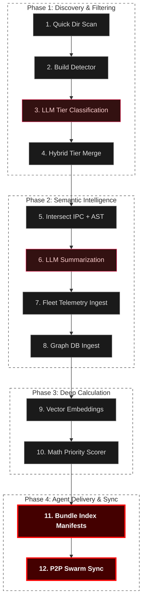

# Code Crawler v3 Workflow

This architectural diagram illustrates the complete 12-step **Indexing Swarm Pipeline**, detailing how raw source code is ingested, pruned, analyzed by AI models, and compiled into zero-latency manifests for autonomous agents.

### Pipeline Overview

* **Phase 1** focuses on drastically reducing the context scale. By intelligently identifying build boundaries and using lightweight LLMs (like Llama-3 8B) to classify code into tiers, we skip massive unneeded subsystems (like upstream Linux networking).
* **Phase 2** is the core semantic layer. Deep abstract syntax trees (ASTs) are bound to inter-process communication definitions, and LLMs write detailed function summaries. Crash trace telemetry is folded into the graph here.
* **Phase 3** calculates spatial priority. The **Math Priority Scorer** algorithm assigns weights based on usage frequency, recency, and crash hits, isolating what truly matters.
* **Phase 4** concludes with static bundle generation. Instead of the LLM searching live DBs constantly, it is fed entirely pre-materialized **Index Manifests**, eliminating expensive multi-hop tool routing. Team changes are instantly shared via **Swarm Sync**.
