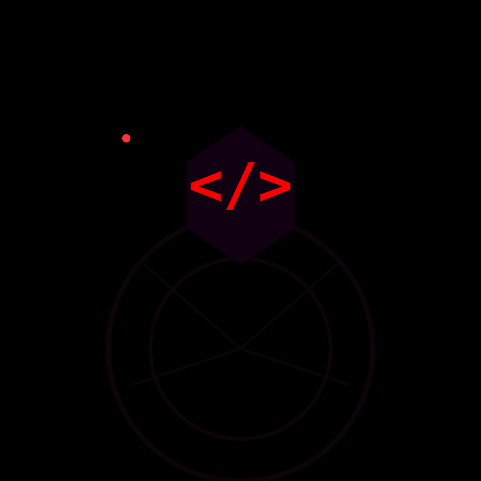

  
  <h1> Code Crawler</h1>
  
<strong>A Semantic AI Code Indexer and Model Context Protocol (MCP) Server</strong>

---

**Code Crawler** is a persistent, AI-driven codebase indexer designed specifically for massive, macro-heavy embedded C/C++ projects (e.g., Yocto, OpenWrt, Linux kernel, RDK-B). 

## 💡 The Problem
Modern Large Language Models (LLMs) cannot fit massive codebases (millions of lines) into their context windows. Simple text search often fails to capture semantic relationships, nested call graphs, and build-system nuances (like complex `#ifdef` chains).

## 🚀 The Solution
Code Crawler prevents the need to feed raw code files to LLMs directly. Instead, it:
1. **Preprocesses** the codebase offline.
2. **Creates** an intelligent database graph.
3. **Acts as an MCP service.** 
The LLM simply asks Code Crawler a question, and Code Crawler responds with precise summaries and exact code pointers.

---

## 📂 Repository Structure

All primary design specifications and project roadmaps have been organized into the [`DOCS/`](./DOCS) directory:

| Document | Description |
|----------|-------------|
| 📜 [**Design Idea**](./DOCS/design_idea.md) | Detailed technical architecture and proposed improvements (e.g., Swarm Indexing, IPC Edges, Proactive AI). |
| 🗺️ [**Version Roadmap**](./DOCS/version_roadmap.md) | The phased rollout plan outlining MVP through advanced AI integration. |
| 🛠️ [**Git Commands Guide**](./DOCS/git_commands_guide.md) | A handy cheat-sheet for syncing, pushing, and pulling the codebase. *(Ignored by Git)* |

---

## 🏗️ Core Architecture Components

1. **Pre-Indexing Engine (The Crawler)**: Scans offline, reads compile commands, and builds an Abstract Syntax Tree (AST) using tools like `tree-sitter` or `libclang`.
2. **Summary Generation**: Passes the AST through a cost-effective LLM iteratively to generate plain-English documentation.
3. **Storage & Database Backend**: Uses Graph/Vector databases alongside SQLite to map relations and process semantic search queries.
4. **API/Integration Layer (MCP)**: Exposes the data natively so IDEs (Cursor, VS Code) and Agent desktops can search the indexed database securely.

## 🛠️ Development Environment
- **Primary Languages:** Python (`mcp`, tooling) & target C/C++
- **Core Libraries:** `tree-sitter`, `sqlite3`
